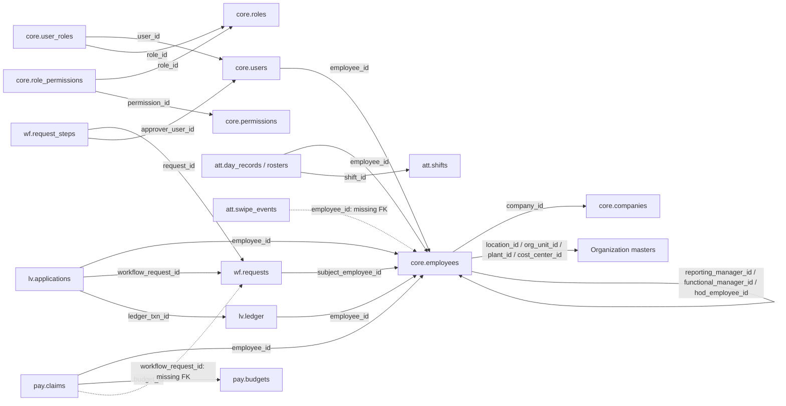

# HRMS table and field relationship review — 07 Oct 2026

Scope: live local schema relationships, not server configuration. Read-only catalog and aggregate checks. Specs: docs 03 and 14; CORE-02/03/08/10/11/12, ATT-01/03, LV-03/05, WF-01/02/04. No database or application changes made. Base relations are shown once; monthly partition copies are omitted. No personal row data is included.

## Verdict

The design has a coherent employee-centered structure and useful module boundaries. Most business connections are protected by foreign keys, and company alignment is protected by composite foreign keys. The weakest area is incomplete enforcement of several logical connections, particularly raw attendance and workflow ownership. A valid individual FK says that a target exists; it does not necessarily say that it belongs to the same employee, leave type or company.

There are **104 business relations**, **192 FK constraints on parent/non-partition tables**, and **15 schemas** including public. Earlier totals of 202 included extra partition-related constraints. All inspected base tables have primary keys. Relationship tables and ledgers correctly use repeated employee references rather than copying employee names into every transaction.

## Main relationship map

Arrows below point from the field carrying the reference to its target. A dashed arrow is a logical/application link without a database FK.

## How the modules connect

| Area | Main field connections | Meaning |
|---|---|---|
| Organization | employees.company_id → companies.id; location_id → locations.id; org_unit_id → org_units.id; plant_id → plants.id; cost_center_id → cost_centers.id | Where an employee legally and operationally belongs |
| Job classification | department_id → departments.id; designation_id → designations.id; grade_id → grades.id | Department, job title and pay grade remain reusable master data |
| Hierarchy | employees.reporting_manager_id / functional_manager_id / hod_employee_id → employees.id | Managers are employees, including legitimate cross-company reporting |
| Login identity | users.employee_id → employees.id | The person and the login account are different records; service/admin accounts can be unlinked |
| Access | user_roles → users + roles + optional org_units; role_permissions → roles + permissions | Many-to-many role grants and scoped access |
| Attendance | day_records and rosters → employees + shifts; devices → locations; device_watermarks → devices | Employee identity, applicable shift and device completeness are separated |
| Leave | applications → employees + leave_types + requests + ledger; ledger → employees + leave_types | Request, approval and balance transaction are separate but linked |
| Workflows | requests → definitions + employees + requesting users; request_steps → requests + approver users | One approval engine can serve multiple HR modules |
| Budgets and claims | budgets → employees + companies + cost_centers; claims → employees + budgets; claim_lines → claims + claim_types; claim_reservations → claims + budgets | Funding, expense items and reservations have explicit relationships |
| Documents | documents → owning employee + uploading user; letters → employees + documents; policies → documents; acknowledgments → employees + policies | One file registry supports several business uses |
| Assets | assignments → assets + employees + assigning/returning users; maintenance → assets | Asset master is separated from custody history |
| Helpdesk and engagement | tickets → categories + raising/assigned users; messages → tickets + users; responses → polls + users | Business subjects and actors are traceable |
| Security | sessions, MFA and password history → users | Security belongs to accounts rather than employee demographics |
| Privacy | consents and requests → employees; notices and acknowledgments → notices/users; approvals → users/requests where declared | Data-subject records and administrator actions remain separate |
| Compliance | registrations → companies + locations; calendar_items → registrations + responsible users; evidence → calendar items/documents where declared | Entity obligations connect to owners and evidence |
| Reporting | muster_month → employees + companies; kpi_daily → companies | Derived reporting tables refer back to business masters |

Payroll runs, salary structures, bank batches and recruitment are not present as a complete live engine. The existing pay schema contains budget/claim-related data; a schema name alone does not establish that payroll is connected end to end.

## What is good

1. **One employee identity.** Most transactions reference employees.id; ecode is the unique external business key. Changes to a name do not require editing attendance, leave or claim rows.
2. **Person versus actor separation.** employee_id identifies whose record it is; user_id identifies who logged in, submitted, approved or changed it. This supports pure administrators without inventing employees.
3. **Company alignment is enforced.** Employee org-unit/location/plant/cost-center composite FKs include company_id. They prevent a valid location ID from being paired with the wrong company. Cost-center-to-plant alignment also has a composite FK.
4. **Requests and postings are distinct.** Leave applications connect to workflows and to immutable ledger transactions. A balance is derived from transactions rather than a manually edited counter.
5. **Workflow steps point to actual accounts.** Approver IDs are FK-protected, and notified_at is mandatory. Delegation has explicit from/to references.
6. **History is protected.** Important audit, raw attendance and leave-ledger tables have immutability triggers. The main transaction FKs generally use NO ACTION rather than indiscriminate cascade deletion.
7. **Existing checked links are internally consistent.** The ownership checks below found no wrong-subject workflow links or claim/budget owner mismatches in the rows they could join. This does not guarantee correctness of future writes.

## What is weak or bad

| Priority | Relationship weakness | Why it matters |
|---|---|---|
| High, actual broken links | swipe_events.employee_id has no FK on the parent or its inspected partitions; **119 non-NULL IDs have no employee row** | An attendance fact can refer to a deleted/nonexistent person; joins can silently omit it. This is different from a deliberate NULL for an unmatched swipe. |
| High, enforcement gap | pay.budgets.workflow_request_id and pay.claims.workflow_request_id have no FK | A budget/claim can point at a nonexistent approval request. No current orphan was found. |
| High, ownership gap | Leave's workflow/ledger links and claims' budget links generally verify each target separately | The FK definitions do not tie the target's employee/type to the requesting row. Current checks found no such mismatch. No composite ownership FK was found; the leave table's inspected triggers do not enforce that pairing. Claim-table trigger and application validation need further review before concluding how all write paths enforce ownership. |
| High, hierarchy gap | reporting_tree IDs have no FKs; manager-tree rebuild stops at depth 50 without rejecting cycles | A finite walk does not make a cyclic hierarchy valid. Cycles can affect access scope and approval routing. No self-path or orphan was found in the current derived tree. |
| Medium, identity cardinality | users.employee_id is an FK but is not UNIQUE | Several accounts can point to one employee. Decide whether this is permitted; if one employee login is required, the database does not enforce it. No duplicate links were observed. |
| Medium, role cardinality | UNIQUE(user_id, role_id, scope_org_unit_id) permits repeated NULL-scope global grants | Duplicate role assignment remains structurally possible. No current duplicate was found. |
| Medium, step cardinality | request_steps has no unique request_id/step_no/approver_user_id tuple | The same approver can be inserted twice for one stage. Multiple different approvers per stage may be valid, so uniqueness on request_id/step_no alone would be too restrictive. |
| Medium, logical references | swipe door_code, recompute employee_id, ledger reference_id and generic history references rely on code/trigger conventions | Some are intentionally flexible, especially raw/quarantined data and polymorphic audit references. Others need stronger validation, explicit reference type, or FK enforcement; do not add blind FKs to every field ending in _id. |
| Medium, performance candidates | **138 of 192** parent-table FK constraints lack a valid non-partial index beginning with all FK columns in the catalog check | This is a review list, not 138 mandatory new indexes. Some have useful partial indexes or are low-volume; repeated/overlapping FKs can share an index. Prioritize employee filters, workflow references and frequent ownership joins, and verify query plans. |
| Readiness | Many required employee organization fields are nullable and currently empty | Links are optional during the documented two-source import, but active operations and payroll need a completion gate. A FK cannot ensure a relationship is filled in if NULL is allowed. |

Current employee_shifts stores one assignment row per employee, not effective-dated history. There is no temporal overlap exclusion anywhere in the inspected DB. This makes historical shift changes a design/readiness concern, not proof of overlapping rows in that current table.

## Relationship consistency checks

Only aggregates were read. Zero-row tables cannot supply strong evidence for a workflow.

| Check | Violations |
|---|---:|
| leave_workflow_wrong_subject | 0 |
| leave_ledger_wrong_owner_or_type | 0 |
| regularization_workflow_wrong_subject | 0 |
| overtime_workflow_wrong_subject | 0 |
| claim_budget_wrong_employee | 0 |
| claim_workflow_orphan | 0 |
| budget_workflow_orphan | 0 |
| swipe_employee_orphan | 119 |
| reporting_tree_orphan | 0 |
| reporting_tree_self_path | 0 |

## Complete foreign-key map

Every FK on a base/parent table is listed below, including composite references. Optionality is recorded in the field inventory. An FK guarantees target existence when its input is non-NULL; business ownership may require a separate constraint.

| Referencing table.field(s) | Target table.field(s) | On delete | Leading full index found |
|---|---|---|---|
| ast.assets.(company_id) | core.companies.(id) | NO ACTION | Yes |
| ast.assets.(created_by) | core.users.(id) | NO ACTION | Review |
| ast.assets.(location_id) | core.locations.(id) | NO ACTION | Review |
| ast.assignments.(asset_id) | ast.assets.(id) | NO ACTION | Review |
| ast.assignments.(assigned_by) | core.users.(id) | NO ACTION | Review |
| ast.assignments.(employee_id) | core.employees.(id) | NO ACTION | Review |
| ast.assignments.(returned_by) | core.users.(id) | NO ACTION | Review |
| ast.maintenance.(asset_id) | ast.assets.(id) | NO ACTION | Yes |
| ast.maintenance.(reported_by) | core.users.(id) | NO ACTION | Review |
| att.absence_cases.(employee_id) | core.employees.(id) | NO ACTION | Review |
| att.absence_cases.(hr_owner_id) | core.users.(id) | NO ACTION | Review |
| att.absence_cases.(letter_id) | core.letters.(id) | NO ACTION | Review |
| att.coverage_targets.(department_id) | core.departments.(id) | NO ACTION | Review |
| att.coverage_targets.(location_id) | core.locations.(id) | NO ACTION | Yes |
| att.coverage_targets.(shift_id) | att.shifts.(id) | NO ACTION | Review |
| att.coverage_targets.(updated_by) | core.users.(id) | NO ACTION | Review |
| att.day_records.(employee_id) | core.employees.(id) | NO ACTION | Yes |
| att.day_records.(leave_type_id) | lv.leave_types.(id) | NO ACTION | Review |
| att.day_records.(shift_id) | att.shifts.(id) | NO ACTION | Review |
| att.device_watermarks.(device_id) | att.devices.(id) | CASCADE | Yes |
| att.devices.(location_id) | core.locations.(id) | NO ACTION | Review |
| att.employee_shifts.(employee_id) | core.employees.(id) | NO ACTION | Yes |
| att.employee_shifts.(saturday_shift_id) | att.shifts.(id) | NO ACTION | Review |
| att.employee_shifts.(updated_by) | core.users.(id) | NO ACTION | Review |
| att.employee_shifts.(weekday_shift_id) | att.shifts.(id) | NO ACTION | Review |
| att.holidays.(location_id) | core.locations.(id) | NO ACTION | Review |
| att.leave_blackouts.(location_id) | core.locations.(id) | NO ACTION | Yes |
| att.manager_month_approvals.(approved_by_user_id) | core.users.(id) | NO ACTION | Review |
| att.manager_month_approvals.(company_id) | core.companies.(id) | NO ACTION | Yes |
| att.manager_month_approvals.(manager_employee_id) | core.employees.(id) | NO ACTION | Review |
| att.month_locks.(company_id) | core.companies.(id) | NO ACTION | Yes |
| att.month_locks.(locked_by) | core.users.(id) | NO ACTION | Review |
| att.overtime_entries.(comp_off_credit_id) | lv.ledger.(id) | NO ACTION | Review |
| att.overtime_entries.(employee_id) | core.employees.(id) | NO ACTION | Yes |
| att.overtime_entries.(manager_id) | core.employees.(id) | NO ACTION | Review |
| att.overtime_entries.(workflow_request_id) | wf.requests.(id) | NO ACTION | Review |
| att.regularizations.(employee_id) | core.employees.(id) | NO ACTION | Yes |
| att.regularizations.(workflow_request_id) | wf.requests.(id) | NO ACTION | Yes |
| att.roster_publications.(manager_employee_id) | core.employees.(id) | NO ACTION | Yes |
| att.roster_publications.(published_by) | core.users.(id) | NO ACTION | Review |
| att.roster_revisions.(changed_by) | core.users.(id) | NO ACTION | Review |
| att.roster_revisions.(employee_id) | core.employees.(id) | NO ACTION | Review |
| att.roster_revisions.(new_shift_id) | att.shifts.(id) | NO ACTION | Review |
| att.roster_revisions.(old_shift_id) | att.shifts.(id) | NO ACTION | Review |
| att.rosters.(employee_id) | core.employees.(id) | NO ACTION | Yes |
| att.rosters.(set_by) | core.users.(id) | NO ACTION | Review |
| att.rosters.(shift_id) | att.shifts.(id) | NO ACTION | Review |
| att.shift_patterns.(created_by) | core.users.(id) | NO ACTION | Review |
| att.shift_swaps.(counterpart_employee_id) | core.employees.(id) | NO ACTION | Review |
| att.shift_swaps.(counterpart_shift_id) | att.shifts.(id) | NO ACTION | Review |
| att.shift_swaps.(requester_employee_id) | core.employees.(id) | NO ACTION | Yes |
| att.shift_swaps.(requester_shift_id) | att.shifts.(id) | NO ACTION | Review |
| att.shift_swaps.(workflow_request_id) | wf.requests.(id) | NO ACTION | Review |
| cmp.calendar_items.(company_id) | core.companies.(id) | NO ACTION | Yes |
| cmp.calendar_items.(filed_by_user_id) | core.users.(id) | NO ACTION | Review |
| cmp.calendar_items.(owner_user_id) | core.users.(id) | NO ACTION | Review |
| cmp.calendar_items.(registration_id) | cmp.registrations.(id) | NO ACTION | Review |
| cmp.calendar_items.(waived_by_user_id) | core.users.(id) | NO ACTION | Review |
| cmp.filing_evidence.(calendar_item_id) | cmp.calendar_items.(id) | NO ACTION | Yes |
| cmp.filing_evidence.(filed_by_user_id) | core.users.(id) | NO ACTION | Review |
| cmp.registrations.(company_id) | core.companies.(id) | NO ACTION | Review |
| cmp.registrations.(location_id) | core.locations.(id) | NO ACTION | Review |
| cmp.registrations.(renewal_owner_user_id) | core.users.(id) | NO ACTION | Review |
| core.audit_log.(actor_user_id) | core.users.(id) | NO ACTION | Review |
| core.audit_log.(scope_org_unit_id) | core.org_units.(id) | NO ACTION | Yes |
| core.cost_centers.(company_id) | core.companies.(id) | NO ACTION | Yes |
| core.cost_centers.(plant_id, company_id) | core.plants.(id, company_id) | NO ACTION | Review |
| core.cost_centers.(plant_id) | core.plants.(id) | NO ACTION | Review |
| core.departments.(mis_code_id) | core.mis_codes.(id) | NO ACTION | Review |
| core.documents.(owner_employee_id) | core.employees.(id) | NO ACTION | Review |
| core.documents.(uploaded_by) | core.users.(id) | NO ACTION | Review |
| core.employee_family.(employee_id) | core.employees.(id) | NO ACTION | Review |
| core.employee_history.(employee_id) | core.employees.(id) | NO ACTION | Review |
| core.employees.(company_id) | core.companies.(id) | NO ACTION | Review |
| core.employees.(cost_center_id, company_id) | core.cost_centers.(id, company_id) | NO ACTION | Review |
| core.employees.(cost_center_id) | core.cost_centers.(id) | NO ACTION | Review |
| core.employees.(department_id) | core.departments.(id) | NO ACTION | Review |
| core.employees.(designation_id) | core.designations.(id) | NO ACTION | Review |
| core.employees.(functional_manager_id) | core.employees.(id) | NO ACTION | Review |
| core.employees.(grade_id) | core.grades.(id) | NO ACTION | Review |
| core.employees.(hod_employee_id) | core.employees.(id) | NO ACTION | Review |
| core.employees.(location_id, company_id) | core.locations.(id, company_id) | NO ACTION | Review |
| core.employees.(location_id) | core.locations.(id) | NO ACTION | Review |
| core.employees.(org_unit_id, company_id) | core.org_units.(id, company_id) | NO ACTION | Review |
| core.employees.(org_unit_id) | core.org_units.(id) | NO ACTION | Review |
| core.employees.(plant_id, company_id) | core.plants.(id, company_id) | NO ACTION | Review |
| core.employees.(plant_id) | core.plants.(id) | NO ACTION | Review |
| core.employees.(reporting_manager_id) | core.employees.(id) | NO ACTION | Yes |
| core.letter_templates.(body_docx_document_id) | core.documents.(id) | NO ACTION | Review |
| core.letters.(document_id) | core.documents.(id) | NO ACTION | Review |
| core.letters.(employee_id) | core.employees.(id) | NO ACTION | Yes |
| core.letters.(issued_by) | core.users.(id) | NO ACTION | Review |
| core.letters.(workflow_request_id) | wf.requests.(id) | NO ACTION | Review |
| core.locations.(company_id) | core.companies.(id) | NO ACTION | Yes |
| core.mis_codes.(company_id) | core.companies.(id) | NO ACTION | Yes |
| core.mis_codes.(parent_id, company_id) | core.mis_codes.(id, company_id) | NO ACTION | Review |
| core.mis_codes.(parent_id) | core.mis_codes.(id) | NO ACTION | Review |
| core.org_units.(company_id) | core.companies.(id) | NO ACTION | Review |
| core.org_units.(parent_id) | core.org_units.(id) | NO ACTION | Review |
| core.password_reset_tokens.(user_id) | core.users.(id) | NO ACTION | Yes |
| core.plants.(company_id) | core.companies.(id) | NO ACTION | Yes |
| core.plants.(location_id, company_id) | core.locations.(id, company_id) | NO ACTION | Review |
| core.plants.(location_id) | core.locations.(id) | NO ACTION | Review |
| core.policies.(created_by) | core.users.(id) | NO ACTION | Review |
| core.policies.(document_id) | core.documents.(id) | NO ACTION | Review |
| core.policy_acknowledgments.(employee_id) | core.employees.(id) | NO ACTION | Review |
| core.policy_acknowledgments.(policy_id) | core.policies.(id) | NO ACTION | Yes |
| core.profile_change_requests.(decided_by) | core.users.(id) | NO ACTION | Review |
| core.profile_change_requests.(employee_id) | core.employees.(id) | NO ACTION | Review |
| core.profile_change_requests.(workflow_request_id) | wf.requests.(id) | NO ACTION | Review |
| core.role_permissions.(permission_id) | core.permissions.(id) | CASCADE | Review |
| core.role_permissions.(role_id) | core.roles.(id) | CASCADE | Yes |
| core.settings.(updated_by) | core.users.(id) | NO ACTION | Review |
| core.user_roles.(role_id) | core.roles.(id) | CASCADE | Review |
| core.user_roles.(scope_org_unit_id) | core.org_units.(id) | NO ACTION | Review |
| core.user_roles.(user_id) | core.users.(id) | CASCADE | Yes |
| core.users.(employee_id) | core.employees.(id) | NO ACTION | Review |
| eng.announcements.(published_by) | core.users.(id) | NO ACTION | Review |
| eng.poll_responses.(poll_id) | eng.polls.(id) | NO ACTION | Yes |
| eng.poll_responses.(respondent_user_id) | core.users.(id) | NO ACTION | Review |
| eng.polls.(created_by) | core.users.(id) | NO ACTION | Review |
| hd.ticket_messages.(author_user_id) | core.users.(id) | NO ACTION | Review |
| hd.ticket_messages.(ticket_id) | hd.tickets.(id) | NO ACTION | Yes |
| hd.tickets.(assignee_user_id) | core.users.(id) | NO ACTION | Review |
| hd.tickets.(category_id) | hd.categories.(id) | NO ACTION | Review |
| hd.tickets.(raised_by) | core.users.(id) | NO ACTION | Yes |
| ird.grievances.(filed_by_user_id) | core.users.(id) | NO ACTION | Review |
| ird.ic_members.(employee_id) | core.employees.(id) | NO ACTION | Review |
| ird.posh_case_access_log.(actor_user_id) | core.users.(id) | NO ACTION | Review |
| ird.posh_case_access_log.(case_id) | ird.posh_cases.(id) | NO ACTION | Review |
| ird.posh_cases.(filed_by_user_id) | core.users.(id) | NO ACTION | Review |
| lv.applications.(cancel_workflow_request_id) | wf.requests.(id) | NO ACTION | Review |
| lv.applications.(employee_id) | core.employees.(id) | NO ACTION | Yes |
| lv.applications.(leave_type_id) | lv.leave_types.(id) | NO ACTION | Review |
| lv.applications.(ledger_txn_id) | lv.ledger.(id) | NO ACTION | Review |
| lv.applications.(workflow_request_id) | wf.requests.(id) | NO ACTION | Yes |
| lv.ledger.(created_by) | core.users.(id) | NO ACTION | Review |
| lv.ledger.(employee_id) | core.employees.(id) | NO ACTION | Yes |
| lv.ledger.(leave_type_id) | lv.leave_types.(id) | NO ACTION | Review |
| lv.restricted_holidays.(location_id) | core.locations.(id) | NO ACTION | Review |
| lv.rh_selections.(employee_id) | core.employees.(id) | NO ACTION | Yes |
| lv.rh_selections.(restricted_holiday_id) | lv.restricted_holidays.(id) | NO ACTION | Review |
| lv.rh_selections.(workflow_request_id) | wf.requests.(id) | NO ACTION | Yes |
| pay.budget_categories.(budget_id) | pay.budgets.(id) | CASCADE | Yes |
| pay.budget_categories.(claim_type_id) | pay.claim_types.(id) | NO ACTION | Review |
| pay.budgets.(approved_by_user_id) | core.users.(id) | NO ACTION | Review |
| pay.budgets.(company_id) | core.companies.(id) | NO ACTION | Yes |
| pay.budgets.(cost_center_id) | core.cost_centers.(id) | NO ACTION | Review |
| pay.budgets.(employee_id) | core.employees.(id) | NO ACTION | Yes |
| pay.claim_lines.(claim_id) | pay.claims.(id) | CASCADE | Yes |
| pay.claim_lines.(claim_type_id) | pay.claim_types.(id) | NO ACTION | Review |
| pay.claim_reservations.(actor_user_id) | core.users.(id) | NO ACTION | Review |
| pay.claim_reservations.(budget_id) | pay.budgets.(id) | NO ACTION | Yes |
| pay.claim_reservations.(claim_id) | pay.claims.(id) | NO ACTION | Yes |
| pay.claims.(budget_id) | pay.budgets.(id) | NO ACTION | Yes |
| pay.claims.(employee_id) | core.employees.(id) | NO ACTION | Yes |
| pay.claims.(reserved_budget_id) | pay.budgets.(id) | NO ACTION | Review |
| pay.claims.(settled_by_user_id) | core.users.(id) | NO ACTION | Review |
| prv.breach_register.(recorded_by) | core.users.(id) | NO ACTION | Review |
| prv.consent_events.(actor_user_id) | core.users.(id) | NO ACTION | Review |
| prv.consent_events.(employee_id) | core.employees.(id) | NO ACTION | Review |
| prv.consents.(employee_id) | core.employees.(id) | NO ACTION | Yes |
| prv.legal_holds.(employee_id) | core.employees.(id) | NO ACTION | Review |
| prv.legal_holds.(placed_by) | core.users.(id) | NO ACTION | Review |
| prv.notice_acks.(notice_id) | prv.notices.(id) | NO ACTION | Yes |
| prv.notice_acks.(user_id) | core.users.(id) | NO ACTION | Review |
| prv.purge_log.(proposal_id) | prv.purge_proposals.(id) | NO ACTION | Review |
| prv.purge_proposals.(confirmed_by) | core.users.(id) | NO ACTION | Review |
| prv.purge_proposals.(proposed_by) | core.users.(id) | NO ACTION | Review |
| prv.retention_rules.(data_class) | prv.processing_register.(data_class) | NO ACTION | Yes |
| prv.rights_requests.(employee_id) | core.employees.(id) | NO ACTION | Review |
| prv.rights_requests.(workflow_request_id) | wf.requests.(id) | NO ACTION | Review |
| reporting.kpi_daily.(company_id) | core.companies.(id) | NO ACTION | Review |
| reporting.muster_month.(company_id) | core.companies.(id) | NO ACTION | Yes |
| reporting.muster_month.(employee_id) | core.employees.(id) | NO ACTION | Review |
| sec.access_events.(actor_user_id) | core.users.(id) | NO ACTION | Yes |
| sec.mfa_enrolments.(disabled_by_user_id) | core.users.(id) | NO ACTION | Review |
| sec.mfa_enrolments.(user_id) | core.users.(id) | NO ACTION | Review |
| sec.mfa_recovery_codes.(enrolment_id) | sec.mfa_enrolments.(id) | CASCADE | Yes |
| sec.password_history.(changed_by_user_id) | core.users.(id) | NO ACTION | Review |
| sec.password_history.(user_id) | core.users.(id) | NO ACTION | Yes |
| sec.sessions.(revoked_by_user_id) | core.users.(id) | NO ACTION | Review |
| sec.sessions.(user_id) | core.users.(id) | NO ACTION | Yes |
| wf.delegations.(from_user_id) | core.users.(id) | NO ACTION | Review |
| wf.delegations.(to_user_id) | core.users.(id) | NO ACTION | Review |
| wf.notifications.(recipient_user_id) | core.users.(id) | NO ACTION | Review |
| wf.request_steps.(approver_user_id) | core.users.(id) | NO ACTION | Review |
| wf.request_steps.(delegated_from) | core.users.(id) | NO ACTION | Review |
| wf.request_steps.(request_id) | wf.requests.(id) | NO ACTION | Yes |
| wf.requests.(definition_code) | wf.definitions.(code) | NO ACTION | Review |
| wf.requests.(requested_by) | core.users.(id) | NO ACTION | Review |
| wf.requests.(subject_employee_id) | core.employees.(id) | NO ACTION | Yes |

## Every field and its connection

Scalar fields store values such as names, amounts, statuses and dates; they do not each need a foreign key. JSON fields can carry application-defined relationships that this catalog review cannot validate. A scalar label below means no declared FK or specifically mapped logical link was found, not that the field is unused.

### ast.assets

| Field | Database type | NULL allowed | Connection |
|---|---|---|---|
| id | bigint | No | Row identifier; inbound references appear in the FK map |
| asset_no | text | No | Scalar / application value; no declared FK |
| category | text | No | Scalar / application value; no declared FK |
| description | text | Yes | Scalar / application value; no declared FK |
| serial_no | text | Yes | Scalar / application value; no declared FK |
| purchase_date | date | Yes | Scalar / application value; no declared FK |
| warranty_till | date | Yes | Scalar / application value; no declared FK |
| status | text | No | Scalar / application value; no declared FK |
| location_id | bigint | Yes | core.locations.id (FK) |
| company_id | bigint | No | core.companies.id (FK) |
| created_by | bigint | Yes | core.users.id (FK) |
| created_at | timestamp with time zone | No | Scalar / application value; no declared FK |
| updated_at | timestamp with time zone | No | Scalar / application value; no declared FK |

### ast.assignments

| Field | Database type | NULL allowed | Connection |
|---|---|---|---|
| id | bigint | No | Row identifier; inbound references appear in the FK map |
| asset_id | bigint | No | ast.assets.id (FK) |
| holder_kind | text | No | Scalar / application value; no declared FK |
| employee_id | bigint | Yes | core.employees.id (FK) |
| third_party_name | text | Yes | Scalar / application value; no declared FK |
| third_party_org | text | Yes | Scalar / application value; no declared FK |
| assigned_at | timestamp with time zone | No | Scalar / application value; no declared FK |
| returned_at | timestamp with time zone | Yes | Scalar / application value; no declared FK |
| return_condition | text | Yes | Scalar / application value; no declared FK |
| notes | text | Yes | Scalar / application value; no declared FK |
| assigned_by | bigint | No | core.users.id (FK) |
| returned_by | bigint | Yes | core.users.id (FK) |
| created_at | timestamp with time zone | No | Scalar / application value; no declared FK |

### ast.maintenance

| Field | Database type | NULL allowed | Connection |
|---|---|---|---|
| id | bigint | No | Row identifier; inbound references appear in the FK map |
| asset_id | bigint | No | ast.assets.id (FK) |
| kind | text | No | Scalar / application value; no declared FK |
| scheduled_for | date | Yes | Scalar / application value; no declared FK |
| reported_by | bigint | Yes | core.users.id (FK) |
| description | text | No | Scalar / application value; no declared FK |
| resolved_at | timestamp with time zone | Yes | Scalar / application value; no declared FK |
| resolution | text | Yes | Scalar / application value; no declared FK |
| cost | numeric(12,2) | Yes | Scalar / application value; no declared FK |
| created_at | timestamp with time zone | No | Scalar / application value; no declared FK |

### att.absence_cases

| Field | Database type | NULL allowed | Connection |
|---|---|---|---|
| id | bigint | No | Row identifier; inbound references appear in the FK map |
| employee_id | bigint | No | core.employees.id (FK) |
| start_date | date | No | Scalar / application value; no declared FK |
| days_absent | smallint | No | Scalar / application value; no declared FK |
| stage | text | No | Scalar / application value; no declared FK |
| letter_id | bigint | Yes | core.letters.id (FK) |
| hr_owner_id | bigint | Yes | core.users.id (FK) |
| resolution | text | Yes | Scalar / application value; no declared FK |
| closed_at | timestamp with time zone | Yes | Scalar / application value; no declared FK |
| created_at | timestamp with time zone | No | Scalar / application value; no declared FK |
| updated_at | timestamp with time zone | No | Scalar / application value; no declared FK |

### att.coverage_targets

| Field | Database type | NULL allowed | Connection |
|---|---|---|---|
| id | bigint | No | Row identifier; inbound references appear in the FK map |
| location_id | bigint | No | core.locations.id (FK) |
| department_id | bigint | Yes | core.departments.id (FK) |
| shift_id | bigint | No | att.shifts.id (FK) |
| weekday | smallint | No | Scalar / application value; no declared FK |
| sanctioned | integer | No | Scalar / application value; no declared FK |
| updated_by | bigint | Yes | core.users.id (FK) |
| created_at | timestamp with time zone | No | Scalar / application value; no declared FK |
| updated_at | timestamp with time zone | No | Scalar / application value; no declared FK |

### att.day_records

| Field | Database type | NULL allowed | Connection |
|---|---|---|---|
| id | bigint | No | Row identifier; inbound references appear in the FK map |
| employee_id | bigint | No | core.employees.id (FK) |
| work_date | date | No | Scalar / application value; no declared FK |
| shift_id | bigint | Yes | att.shifts.id (FK) |
| status | att.day_status | No | Scalar / application value; no declared FK |
| leave_type_id | bigint | Yes | lv.leave_types.id (FK) |
| first_in | timestamp with time zone | Yes | Scalar / application value; no declared FK |
| last_out | timestamp with time zone | Yes | Scalar / application value; no declared FK |
| worked_minutes | integer | Yes | Scalar / application value; no declared FK |
| late_minutes | smallint | No | Scalar / application value; no declared FK |
| early_exit_minutes | smallint | No | Scalar / application value; no declared FK |
| ot_minutes | smallint | No | Scalar / application value; no declared FK |
| weekoff_paid | boolean | Yes | Scalar / application value; no declared FK |
| session_statuses | jsonb | Yes | Scalar / application value; no declared FK |
| scheme_code | text | Yes | Scalar / application value; no declared FK |
| penalty_flag | boolean | No | Scalar / application value; no declared FK |
| source | text | No | Scalar / application value; no declared FK |
| override_reason | text | Yes | Scalar / application value; no declared FK |
| is_locked | boolean | No | Scalar / application value; no declared FK |
| computed_at | timestamp with time zone | Yes | Scalar / application value; no declared FK |
| created_at | timestamp with time zone | No | Scalar / application value; no declared FK |
| updated_at | timestamp with time zone | No | Scalar / application value; no declared FK |

### att.device_watermarks

| Field | Database type | NULL allowed | Connection |
|---|---|---|---|
| device_id | bigint | No | att.devices.id (FK) |
| watermark_ts | timestamp with time zone | No | Scalar / application value; no declared FK |
| updated_at | timestamp with time zone | No | Scalar / application value; no declared FK |

### att.devices

| Field | Database type | NULL allowed | Connection |
|---|---|---|---|
| id | bigint | No | Row identifier; inbound references appear in the FK map |
| source | text | No | Scalar / application value; no declared FK |
| door_code | text | No | Scalar / application value; no declared FK |
| location_id | bigint | Yes | core.locations.id (FK) |
| last_seen_at | timestamp with time zone | Yes | Scalar / application value; no declared FK |
| expected_hourly_swipes | numeric(8,2) | Yes | Scalar / application value; no declared FK |
| is_active | boolean | No | Scalar / application value; no declared FK |
| created_at | timestamp with time zone | No | Scalar / application value; no declared FK |
| updated_at | timestamp with time zone | No | Scalar / application value; no declared FK |
| alerted_silent_at | timestamp with time zone | Yes | Scalar / application value; no declared FK |

### att.employee_shifts

| Field | Database type | NULL allowed | Connection |
|---|---|---|---|
| employee_id | bigint | No | core.employees.id (FK) |
| weekday_shift_id | bigint | No | att.shifts.id (FK) |
| saturday_shift_id | bigint | Yes | att.shifts.id (FK) |
| updated_by | bigint | Yes | core.users.id (FK) |
| created_at | timestamp with time zone | No | Scalar / application value; no declared FK |
| updated_at | timestamp with time zone | No | Scalar / application value; no declared FK |

### att.holidays

| Field | Database type | NULL allowed | Connection |
|---|---|---|---|
| id | bigint | No | Row identifier; inbound references appear in the FK map |
| location_id | bigint | Yes | core.locations.id (FK) |
| holiday_date | date | No | Scalar / application value; no declared FK |
| name | text | No | Scalar / application value; no declared FK |
| created_at | timestamp with time zone | No | Scalar / application value; no declared FK |
| updated_at | timestamp with time zone | No | Scalar / application value; no declared FK |

### att.ingest_watermarks

| Field | Database type | NULL allowed | Connection |
|---|---|---|---|
| source | text | No | Scalar / application value; no declared FK |
| watermark_ts | timestamp with time zone | No | Scalar / application value; no declared FK |
| updated_at | timestamp with time zone | No | Scalar / application value; no declared FK |

### att.leave_blackouts

| Field | Database type | NULL allowed | Connection |
|---|---|---|---|
| id | bigint | No | Row identifier; inbound references appear in the FK map |
| blackout_date | date | No | Scalar / application value; no declared FK |
| location_id | bigint | Yes | core.locations.id (FK) |
| name | text | No | Scalar / application value; no declared FK |
| created_at | timestamp with time zone | No | Scalar / application value; no declared FK |
| updated_at | timestamp with time zone | No | Scalar / application value; no declared FK |

### att.manager_month_approvals

| Field | Database type | NULL allowed | Connection |
|---|---|---|---|
| id | bigint | No | Row identifier; inbound references appear in the FK map |
| company_id | bigint | No | core.companies.id (FK) |
| month | date | No | Scalar / application value; no declared FK |
| manager_employee_id | bigint | No | core.employees.id (FK) |
| approved_by_user_id | bigint | Yes | core.users.id (FK) |
| approved_at | timestamp with time zone | No | Scalar / application value; no declared FK |
| note | text | Yes | Scalar / application value; no declared FK |
| created_at | timestamp with time zone | No | Scalar / application value; no declared FK |
| event_type | text | No | Scalar / application value; no declared FK |

### att.month_locks

| Field | Database type | NULL allowed | Connection |
|---|---|---|---|
| id | bigint | No | Row identifier; inbound references appear in the FK map |
| company_id | bigint | No | core.companies.id (FK) |
| month | date | No | Scalar / application value; no declared FK |
| locked_by | bigint | No | core.users.id (FK) |
| locked_at | timestamp with time zone | No | Scalar / application value; no declared FK |
| checklist | jsonb | No | Scalar / application value; no declared FK |
| created_at | timestamp with time zone | No | Scalar / application value; no declared FK |

### att.overtime_entries

| Field | Database type | NULL allowed | Connection |
|---|---|---|---|
| id | bigint | No | Row identifier; inbound references appear in the FK map |
| employee_id | bigint | No | core.employees.id (FK) |
| work_date | date | No | Scalar / application value; no declared FK |
| detected_minutes | smallint | No | Scalar / application value; no declared FK |
| claimed_minutes | smallint | No | Scalar / application value; no declared FK |
| approved_minutes | smallint | Yes | Scalar / application value; no declared FK |
| status | text | No | Scalar / application value; no declared FK |
| manager_id | bigint | Yes | core.employees.id (FK) |
| decided_at | timestamp with time zone | Yes | Scalar / application value; no declared FK |
| deadline_at | timestamp with time zone | No | Scalar / application value; no declared FK |
| workflow_request_id | bigint | Yes | wf.requests.id (FK) |
| comp_off_credit_id | bigint | Yes | lv.ledger.id (FK) |
| payroll_item_id | bigint | Yes | Reserved future payroll output link; no current FK/target table |
| created_at | timestamp with time zone | No | Scalar / application value; no declared FK |
| updated_at | timestamp with time zone | No | Scalar / application value; no declared FK |

### att.quarantined_swipes

| Field | Database type | NULL allowed | Connection |
|---|---|---|---|
| id | bigint | No | Row identifier; inbound references appear in the FK map |
| employee_no | text | No | Source employee code awaiting validation; intentionally not a strict FK |
| swipe_ts | timestamp with time zone | No | Scalar / application value; no declared FK |
| door_code | text | Yes | Source door code awaiting validation; intentionally not a strict FK |
| direction | text | Yes | Scalar / application value; no declared FK |
| swipe_type | text | Yes | Scalar / application value; no declared FK |
| received_at | timestamp with time zone | No | Scalar / application value; no declared FK |
| source | text | No | Scalar / application value; no declared FK |
| reason | text | No | Scalar / application value; no declared FK |
| reviewed | boolean | No | Scalar / application value; no declared FK |
| created_at | timestamp with time zone | No | Scalar / application value; no declared FK |

### att.recompute_queue

| Field | Database type | NULL allowed | Connection |
|---|---|---|---|
| employee_id | bigint | No | core.employees.id — logical link; NO FK |
| work_date | date | No | Scalar / application value; no declared FK |
| queued_at | timestamp with time zone | No | Scalar / application value; no declared FK |

### att.regularizations

| Field | Database type | NULL allowed | Connection |
|---|---|---|---|
| id | bigint | No | Row identifier; inbound references appear in the FK map |
| employee_id | bigint | No | core.employees.id (FK) |
| kind | text | No | Scalar / application value; no declared FK |
| from_date | date | No | Scalar / application value; no declared FK |
| to_date | date | No | Scalar / application value; no declared FK |
| from_time | time without time zone | Yes | Scalar / application value; no declared FK |
| to_time | time without time zone | Yes | Scalar / application value; no declared FK |
| reason | text | No | Scalar / application value; no declared FK |
| requested_status | att.day_status | No | Scalar / application value; no declared FK |
| workflow_request_id | bigint | No | wf.requests.id (FK) |
| applied | boolean | No | Scalar / application value; no declared FK |
| created_at | timestamp with time zone | No | Scalar / application value; no declared FK |
| updated_at | timestamp with time zone | No | Scalar / application value; no declared FK |

### att.roster_publications

| Field | Database type | NULL allowed | Connection |
|---|---|---|---|
| id | bigint | No | Row identifier; inbound references appear in the FK map |
| manager_employee_id | bigint | No | core.employees.id (FK) |
| period_from | date | No | Scalar / application value; no declared FK |
| period_to | date | No | Scalar / application value; no declared FK |
| published_at | timestamp with time zone | No | Scalar / application value; no declared FK |
| published_by | bigint | No | core.users.id (FK) |
| revision | integer | No | Scalar / application value; no declared FK |
| reason | text | Yes | Scalar / application value; no declared FK |

### att.roster_revisions

| Field | Database type | NULL allowed | Connection |
|---|---|---|---|
| id | bigint | No | Row identifier; inbound references appear in the FK map |
| employee_id | bigint | No | core.employees.id (FK) |
| work_date | date | No | Scalar / application value; no declared FK |
| old_shift_id | bigint | Yes | att.shifts.id (FK) |
| new_shift_id | bigint | Yes | att.shifts.id (FK) |
| old_week_off | boolean | No | Scalar / application value; no declared FK |
| new_week_off | boolean | No | Scalar / application value; no declared FK |
| reason | text | No | Scalar / application value; no declared FK |
| changed_by | bigint | No | core.users.id (FK) |
| changed_at | timestamp with time zone | No | Scalar / application value; no declared FK |

### att.rosters

| Field | Database type | NULL allowed | Connection |
|---|---|---|---|
| id | bigint | No | Row identifier; inbound references appear in the FK map |
| employee_id | bigint | No | core.employees.id (FK) |
| work_date | date | No | Scalar / application value; no declared FK |
| shift_id | bigint | Yes | att.shifts.id (FK) |
| is_week_off | boolean | No | Scalar / application value; no declared FK |
| set_by | bigint | Yes | core.users.id (FK) |
| created_at | timestamp with time zone | No | Scalar / application value; no declared FK |
| updated_at | timestamp with time zone | No | Scalar / application value; no declared FK |

### att.shift_patterns

| Field | Database type | NULL allowed | Connection |
|---|---|---|---|
| id | bigint | No | Row identifier; inbound references appear in the FK map |
| code | text | No | Scalar / application value; no declared FK |
| name | text | No | Scalar / application value; no declared FK |
| cycle | jsonb | No | Scalar / application value; no declared FK |
| created_by | bigint | Yes | core.users.id (FK) |
| created_at | timestamp with time zone | No | Scalar / application value; no declared FK |
| updated_at | timestamp with time zone | No | Scalar / application value; no declared FK |

### att.shift_swaps

| Field | Database type | NULL allowed | Connection |
|---|---|---|---|
| id | bigint | No | Row identifier; inbound references appear in the FK map |
| requester_employee_id | bigint | No | core.employees.id (FK) |
| counterpart_employee_id | bigint | Yes | core.employees.id (FK) |
| work_date | date | No | Scalar / application value; no declared FK |
| requester_shift_id | bigint | Yes | att.shifts.id (FK) |
| counterpart_shift_id | bigint | Yes | att.shifts.id (FK) |
| kind | text | No | Scalar / application value; no declared FK |
| workflow_request_id | bigint | No | wf.requests.id (FK) |
| applied | boolean | No | Scalar / application value; no declared FK |
| created_at | timestamp with time zone | No | Scalar / application value; no declared FK |

### att.shifts

| Field | Database type | NULL allowed | Connection |
|---|---|---|---|
| id | bigint | No | Row identifier; inbound references appear in the FK map |
| code | text | No | Scalar / application value; no declared FK |
| name | text | No | Scalar / application value; no declared FK |
| start_time | time without time zone | No | Scalar / application value; no declared FK |
| end_time | time without time zone | No | Scalar / application value; no declared FK |
| crosses_midnight | boolean | No | Scalar / application value; no declared FK |
| session_split | time without time zone | Yes | Scalar / application value; no declared FK |
| grace_in_minutes | smallint | No | Scalar / application value; no declared FK |
| grace_out_minutes | smallint | No | Scalar / application value; no declared FK |
| min_half_day_hours | numeric(4,2) | No | Scalar / application value; no declared FK |
| min_full_day_hours | numeric(4,2) | No | Scalar / application value; no declared FK |
| break_minutes | smallint | No | Scalar / application value; no declared FK |
| is_active | boolean | No | Scalar / application value; no declared FK |
| created_at | timestamp with time zone | No | Scalar / application value; no declared FK |
| updated_at | timestamp with time zone | No | Scalar / application value; no declared FK |
| break_paid | boolean | No | Scalar / application value; no declared FK |
| ot_start_offset_minutes | smallint | No | Scalar / application value; no declared FK |
| late_slabs | jsonb | No | Scalar / application value; no declared FK |
| early_exit_slabs | jsonb | No | Scalar / application value; no declared FK |
| allowance_component_code | text | Yes | Scalar / application value; no declared FK |
| session2_start | time without time zone | Yes | Scalar / application value; no declared FK |
| session2_end | time without time zone | Yes | Scalar / application value; no declared FK |

### att.swipe_events

| Field | Database type | NULL allowed | Connection |
|---|---|---|---|
| id | bigint | No | Row identifier; inbound references appear in the FK map |
| employee_id | bigint | Yes | core.employees.id — logical link; NO FK; 119 dangling IDs observed |
| employee_no | text | No | core.employees.ecode — source identity matched during ingestion; preserved raw text |
| access_card | text | Yes | Scalar / application value; no declared FK |
| shift_label | text | Yes | Scalar / application value; no declared FK |
| swipe_ts | timestamp with time zone | No | Scalar / application value; no declared FK |
| door_code | text | Yes | att.devices.door_code — logical link; NO FK |
| longitude | numeric(9,6) | Yes | Scalar / application value; no declared FK |
| latitude | numeric(9,6) | Yes | Scalar / application value; no declared FK |
| location_type | text | Yes | Scalar / application value; no declared FK |
| mobile_device_name | text | Yes | Scalar / application value; no declared FK |
| mobile_device_id | text | Yes | Scalar / application value; no declared FK |
| swipe_type | text | Yes | Scalar / application value; no declared FK |
| direction | text | Yes | Scalar / application value; no declared FK |
| remarks | text | Yes | Scalar / application value; no declared FK |
| permission_reason | text | Yes | Scalar / application value; no declared FK |
| signed_by | text | Yes | Scalar / application value; no declared FK |
| received_at | timestamp with time zone | No | Scalar / application value; no declared FK |
| source | text | No | Scalar / application value; no declared FK |
| created_at | timestamp with time zone | No | Scalar / application value; no declared FK |

### cmp.calendar_items

| Field | Database type | NULL allowed | Connection |
|---|---|---|---|
| id | bigint | No | Row identifier; inbound references appear in the FK map |
| company_id | bigint | No | core.companies.id (FK) |
| obligation_code | text | No | Scalar / application value; no declared FK |
| title | text | No | Scalar / application value; no declared FK |
| frequency | text | No | Scalar / application value; no declared FK |
| period_label | text | No | Scalar / application value; no declared FK |
| due_on | date | No | Scalar / application value; no declared FK |
| owner_user_id | bigint | Yes | core.users.id (FK) |
| status | text | No | Scalar / application value; no declared FK |
| registration_id | bigint | Yes | cmp.registrations.id (FK) |
| filed_at | timestamp with time zone | Yes | Scalar / application value; no declared FK |
| filed_by_user_id | bigint | Yes | core.users.id (FK) |
| waived_reason | text | Yes | Scalar / application value; no declared FK |
| waived_by_user_id | bigint | Yes | core.users.id (FK) |
| waived_at | timestamp with time zone | Yes | Scalar / application value; no declared FK |
| created_at | timestamp with time zone | No | Scalar / application value; no declared FK |
| updated_at | timestamp with time zone | No | Scalar / application value; no declared FK |

### cmp.filing_evidence

| Field | Database type | NULL allowed | Connection |
|---|---|---|---|
| id | bigint | No | Row identifier; inbound references appear in the FK map |
| calendar_item_id | bigint | No | cmp.calendar_items.id (FK) |
| reference | text | No | Scalar / application value; no declared FK |
| document_path | text | Yes | Scalar / application value; no declared FK |
| remark | text | Yes | Scalar / application value; no declared FK |
| filed_by_user_id | bigint | No | core.users.id (FK) |
| recorded_at | timestamp with time zone | No | Scalar / application value; no declared FK |

### cmp.registrations

| Field | Database type | NULL allowed | Connection |
|---|---|---|---|
| id | bigint | No | Row identifier; inbound references appear in the FK map |
| company_id | bigint | No | core.companies.id (FK) |
| location_id | bigint | Yes | core.locations.id (FK) |
| kind | text | No | Scalar / application value; no declared FK |
| registration_no | text | No | Scalar / application value; no declared FK |
| issuing_authority | text | Yes | Scalar / application value; no declared FK |
| valid_from | date | No | Scalar / application value; no declared FK |
| valid_to | date | Yes | Scalar / application value; no declared FK |
| renewal_owner_user_id | bigint | Yes | core.users.id (FK) |
| document_path | text | Yes | Scalar / application value; no declared FK |
| notes | text | Yes | Scalar / application value; no declared FK |
| is_active | boolean | No | Scalar / application value; no declared FK |
| created_at | timestamp with time zone | No | Scalar / application value; no declared FK |
| updated_at | timestamp with time zone | No | Scalar / application value; no declared FK |

### core.audit_log

| Field | Database type | NULL allowed | Connection |
|---|---|---|---|
| id | bigint | No | Row identifier; inbound references appear in the FK map |
| actor_user_id | bigint | Yes | core.users.id (FK) |
| action | text | No | Scalar / application value; no declared FK |
| entity | text | No | Scalar / application value; no declared FK |
| entity_id | bigint | Yes | Polymorphic reference interpreted with entity; intentionally NO single-table FK |
| field | text | Yes | Scalar / application value; no declared FK |
| old_value | text | Yes | Scalar / application value; no declared FK |
| new_value | text | Yes | Scalar / application value; no declared FK |
| ip | inet | Yes | Scalar / application value; no declared FK |
| at | timestamp with time zone | No | Scalar / application value; no declared FK |
| prev_hash | text | No | Scalar / application value; no declared FK |
| row_hash | text | No | Scalar / application value; no declared FK |
| scope_org_unit_id | bigint | Yes | core.org_units.id (FK) |
| hash_version | smallint | No | Scalar / application value; no declared FK |
| chain_seq | bigint | No | Scalar / application value; no declared FK |

### core.companies

| Field | Database type | NULL allowed | Connection |
|---|---|---|---|
| id | bigint | No | Row identifier; inbound references appear in the FK map |
| code | text | No | Scalar / application value; no declared FK |
| name | text | No | Scalar / application value; no declared FK |
| ecode_prefix | text | No | Scalar / application value; no declared FK |
| ecode_next_seq | integer | No | Scalar / application value; no declared FK |
| is_india_payroll | boolean | No | Scalar / application value; no declared FK |
| gstin | text | Yes | Scalar / application value; no declared FK |
| pan | text | Yes | Scalar / application value; no declared FK |
| pf_establishment_code | text | Yes | Scalar / application value; no declared FK |
| esic_code | text | Yes | Scalar / application value; no declared FK |
| pt_registration_no | text | Yes | Scalar / application value; no declared FK |
| tan | text | Yes | Scalar / application value; no declared FK |
| address | text | Yes | Scalar / application value; no declared FK |
| created_at | timestamp with time zone | No | Scalar / application value; no declared FK |
| updated_at | timestamp with time zone | No | Scalar / application value; no declared FK |
| sap_company_code | text | Yes | Scalar / application value; no declared FK |

### core.cost_centers

| Field | Database type | NULL allowed | Connection |
|---|---|---|---|
| id | bigint | No | Row identifier; inbound references appear in the FK map |
| company_id | bigint | No | core.companies.id (FK); core.plants.company_id (composite FK) |
| code | text | No | Scalar / application value; no declared FK |
| name | text | No | Scalar / application value; no declared FK |
| created_at | timestamp with time zone | No | Scalar / application value; no declared FK |
| updated_at | timestamp with time zone | No | Scalar / application value; no declared FK |
| plant_id | bigint | Yes | core.plants.id (composite FK); core.plants.id (FK) |

### core.departments

| Field | Database type | NULL allowed | Connection |
|---|---|---|---|
| id | bigint | No | Row identifier; inbound references appear in the FK map |
| name | text | No | Scalar / application value; no declared FK |
| created_at | timestamp with time zone | No | Scalar / application value; no declared FK |
| updated_at | timestamp with time zone | No | Scalar / application value; no declared FK |
| mis_code_id | bigint | Yes | core.mis_codes.id (FK) |

### core.designations

| Field | Database type | NULL allowed | Connection |
|---|---|---|---|
| id | bigint | No | Row identifier; inbound references appear in the FK map |
| name | text | No | Scalar / application value; no declared FK |
| created_at | timestamp with time zone | No | Scalar / application value; no declared FK |
| updated_at | timestamp with time zone | No | Scalar / application value; no declared FK |

### core.documents

| Field | Database type | NULL allowed | Connection |
|---|---|---|---|
| id | bigint | No | Row identifier; inbound references appear in the FK map |
| owner_employee_id | bigint | Yes | core.employees.id (FK) |
| kind | text | No | Scalar / application value; no declared FK |
| path | text | No | Scalar / application value; no declared FK |
| original_name | text | No | Scalar / application value; no declared FK |
| mime | text | No | Scalar / application value; no declared FK |
| size_bytes | integer | No | Scalar / application value; no declared FK |
| uploaded_by | bigint | Yes | core.users.id (FK) |
| created_at | timestamp with time zone | No | Scalar / application value; no declared FK |
| updated_at | timestamp with time zone | No | Scalar / application value; no declared FK |
| expires_on | date | Yes | Scalar / application value; no declared FK |
| status | text | No | Scalar / application value; no declared FK |

### core.employee_family

| Field | Database type | NULL allowed | Connection |
|---|---|---|---|
| id | bigint | No | Row identifier; inbound references appear in the FK map |
| employee_id | bigint | No | core.employees.id (FK) |
| name | text | No | Scalar / application value; no declared FK |
| relation | text | No | Scalar / application value; no declared FK |
| dob | date | Yes | Scalar / application value; no declared FK |
| aadhaar | text | Yes | Scalar / application value; no declared FK |
| is_esic_dependent | boolean | No | Scalar / application value; no declared FK |
| is_nominee | boolean | No | Scalar / application value; no declared FK |
| nominee_share_pct | numeric(5,2) | Yes | Scalar / application value; no declared FK |
| created_at | timestamp with time zone | No | Scalar / application value; no declared FK |
| updated_at | timestamp with time zone | No | Scalar / application value; no declared FK |

### core.employee_history

| Field | Database type | NULL allowed | Connection |
|---|---|---|---|
| id | bigint | No | Row identifier; inbound references appear in the FK map |
| employee_id | bigint | No | core.employees.id (FK) |
| effective_date | date | No | Scalar / application value; no declared FK |
| change_type | text | No | Scalar / application value; no declared FK |
| field | text | No | Scalar / application value; no declared FK |
| old_value | text | Yes | Scalar / application value; no declared FK |
| new_value | text | Yes | Scalar / application value; no declared FK |
| reference_id | bigint | Yes | Polymorphic reference to the originating business request; NO FK |
| created_at | timestamp with time zone | No | Scalar / application value; no declared FK |
| updated_at | timestamp with time zone | No | Scalar / application value; no declared FK |

### core.employees

| Field | Database type | NULL allowed | Connection |
|---|---|---|---|
| id | bigint | No | Row identifier; inbound references appear in the FK map |
| ecode | text | No | Unique business identity used to match external employee_no; internal relationships use id |
| company_id | bigint | No | core.companies.id (FK); core.cost_centers.company_id (composite FK); core.locations.company_id (composite FK); core.org_units.company_id (composite FK); core.plants.company_id (composite FK) |
| first_name | text | No | Scalar / application value; no declared FK |
| last_name | text | Yes | Scalar / application value; no declared FK |
| photo_path | text | Yes | Scalar / application value; no declared FK |
| gender | text | Yes | Scalar / application value; no declared FK |
| dob | date | Yes | Scalar / application value; no declared FK |
| marital_status | text | Yes | Scalar / application value; no declared FK |
| blood_group | text | Yes | Scalar / application value; no declared FK |
| personal_email | text | Yes | Scalar / application value; no declared FK |
| work_email | citext | Yes | Scalar / application value; no declared FK |
| mobile | text | Yes | Scalar / application value; no declared FK |
| emergency_contact_name | text | Yes | Scalar / application value; no declared FK |
| emergency_contact_phone | text | Yes | Scalar / application value; no declared FK |
| present_address | text | Yes | Scalar / application value; no declared FK |
| permanent_address | text | Yes | Scalar / application value; no declared FK |
| category | core.employment_category | Yes | Scalar / application value; no declared FK |
| contract_type | core.contract_type | Yes | Scalar / application value; no declared FK |
| contract_end_date | date | Yes | Scalar / application value; no declared FK |
| doj | date | Yes | Scalar / application value; no declared FK |
| dol | date | Yes | Scalar / application value; no declared FK |
| status | core.employee_status | No | Scalar / application value; no declared FK |
| exit_reason | text | Yes | Scalar / application value; no declared FK |
| designation_id | bigint | Yes | core.designations.id (FK) |
| department_id | bigint | Yes | core.departments.id (FK) |
| org_unit_id | bigint | Yes | core.org_units.id (composite FK); core.org_units.id (FK) |
| location_id | bigint | Yes | core.locations.id (composite FK); core.locations.id (FK) |
| cost_center_id | bigint | Yes | core.cost_centers.id (composite FK); core.cost_centers.id (FK) |
| grade_id | bigint | Yes | core.grades.id (FK) |
| reporting_manager_id | bigint | Yes | core.employees.id (FK) |
| functional_manager_id | bigint | Yes | core.employees.id (FK) |
| probation_months | smallint | Yes | Scalar / application value; no declared FK |
| probation_salary_pct | smallint | Yes | Scalar / application value; no declared FK |
| probation_due_date | date | Yes | Scalar / application value; no declared FK |
| confirmation_date | date | Yes | Scalar / application value; no declared FK |
| pan | text | Yes | Scalar / application value; no declared FK |
| aadhaar | text | Yes | Scalar / application value; no declared FK |
| uan | text | Yes | Scalar / application value; no declared FK |
| pf_number | text | Yes | Scalar / application value; no declared FK |
| esic_ip_number | text | Yes | Scalar / application value; no declared FK |
| pf_applicable | boolean | No | Scalar / application value; no declared FK |
| esic_applicable | boolean | No | Scalar / application value; no declared FK |
| pt_applicable | boolean | No | Scalar / application value; no declared FK |
| lwf_applicable | boolean | No | Scalar / application value; no declared FK |
| tax_regime | text | No | Scalar / application value; no declared FK |
| bank_name | text | Yes | Scalar / application value; no declared FK |
| bank_account | text | Yes | Scalar / application value; no declared FK |
| bank_ifsc | text | Yes | Scalar / application value; no declared FK |
| payment_mode | text | No | Scalar / application value; no declared FK |
| access_card_no | text | Yes | Scalar / application value; no declared FK |
| biometric_registered | boolean | No | Scalar / application value; no declared FK |
| attendance_mode | text | No | Scalar / application value; no declared FK |
| created_at | timestamp with time zone | No | Scalar / application value; no declared FK |
| updated_at | timestamp with time zone | No | Scalar / application value; no declared FK |
| plant_id | bigint | Yes | core.plants.id (composite FK); core.plants.id (FK) |
| hod_employee_id | bigint | Yes | core.employees.id (FK) |

### core.grades

| Field | Database type | NULL allowed | Connection |
|---|---|---|---|
| id | bigint | No | Row identifier; inbound references appear in the FK map |
| code | text | No | Scalar / application value; no declared FK |
| name | text | No | Scalar / application value; no declared FK |
| rank | smallint | No | Scalar / application value; no declared FK |
| created_at | timestamp with time zone | No | Scalar / application value; no declared FK |
| updated_at | timestamp with time zone | No | Scalar / application value; no declared FK |

### core.letter_templates

| Field | Database type | NULL allowed | Connection |
|---|---|---|---|
| id | bigint | No | Row identifier; inbound references appear in the FK map |
| code | text | No | Scalar / application value; no declared FK |
| name | text | No | Scalar / application value; no declared FK |
| body_template | text | No | Scalar / application value; no declared FK |
| body_docx_document_id | bigint | Yes | core.documents.id (FK) |
| merge_fields | jsonb | No | Scalar / application value; no declared FK |
| is_active | boolean | No | Scalar / application value; no declared FK |
| created_at | timestamp with time zone | No | Scalar / application value; no declared FK |
| updated_at | timestamp with time zone | No | Scalar / application value; no declared FK |

### core.letters

| Field | Database type | NULL allowed | Connection |
|---|---|---|---|
| id | bigint | No | Row identifier; inbound references appear in the FK map |
| employee_id | bigint | No | core.employees.id (FK) |
| template_code | text | No | Scalar / application value; no declared FK |
| document_id | bigint | Yes | core.documents.id (FK) |
| issued_by | bigint | Yes | core.users.id (FK) |
| issued_at | timestamp with time zone | Yes | Scalar / application value; no declared FK |
| workflow_request_id | bigint | Yes | wf.requests.id (FK) |
| created_at | timestamp with time zone | No | Scalar / application value; no declared FK |
| updated_at | timestamp with time zone | No | Scalar / application value; no declared FK |
| body_rendered | text | No | Scalar / application value; no declared FK |
| status | text | No | Scalar / application value; no declared FK |

### core.locations

| Field | Database type | NULL allowed | Connection |
|---|---|---|---|
| id | bigint | No | Row identifier; inbound references appear in the FK map |
| company_id | bigint | No | core.companies.id (FK) |
| name | text | No | Scalar / application value; no declared FK |
| state_code | text | No | Scalar / application value; no declared FK |
| timezone | text | No | Scalar / application value; no declared FK |
| created_at | timestamp with time zone | No | Scalar / application value; no declared FK |
| updated_at | timestamp with time zone | No | Scalar / application value; no declared FK |

### core.mis_codes

| Field | Database type | NULL allowed | Connection |
|---|---|---|---|
| id | bigint | No | Row identifier; inbound references appear in the FK map |
| company_id | bigint | No | core.companies.id (FK); core.mis_codes.company_id (composite FK) |
| code | text | No | Scalar / application value; no declared FK |
| name | text | No | Scalar / application value; no declared FK |
| parent_id | bigint | Yes | core.mis_codes.id (composite FK); core.mis_codes.id (FK) |
| is_active | boolean | No | Scalar / application value; no declared FK |
| created_at | timestamp with time zone | No | Scalar / application value; no declared FK |
| updated_at | timestamp with time zone | No | Scalar / application value; no declared FK |

### core.org_units

| Field | Database type | NULL allowed | Connection |
|---|---|---|---|
| id | bigint | No | Row identifier; inbound references appear in the FK map |
| company_id | bigint | No | core.companies.id (FK) |
| parent_id | bigint | Yes | core.org_units.id (FK) |
| name | text | No | Scalar / application value; no declared FK |
| created_at | timestamp with time zone | No | Scalar / application value; no declared FK |
| updated_at | timestamp with time zone | No | Scalar / application value; no declared FK |

### core.password_reset_tokens

| Field | Database type | NULL allowed | Connection |
|---|---|---|---|
| id | bigint | No | Row identifier; inbound references appear in the FK map |
| user_id | bigint | No | core.users.id (FK) |
| token_hash | text | No | Scalar / application value; no declared FK |
| expires_at | timestamp with time zone | No | Scalar / application value; no declared FK |
| used_at | timestamp with time zone | Yes | Scalar / application value; no declared FK |
| created_at | timestamp with time zone | No | Scalar / application value; no declared FK |

### core.permissions

| Field | Database type | NULL allowed | Connection |
|---|---|---|---|
| id | bigint | No | Row identifier; inbound references appear in the FK map |
| code | text | No | Scalar / application value; no declared FK |
| created_at | timestamp with time zone | No | Scalar / application value; no declared FK |
| updated_at | timestamp with time zone | No | Scalar / application value; no declared FK |

### core.plants

| Field | Database type | NULL allowed | Connection |
|---|---|---|---|
| id | bigint | No | Row identifier; inbound references appear in the FK map |
| company_id | bigint | No | core.companies.id (FK); core.locations.company_id (composite FK) |
| plant_code | text | No | Scalar / application value; no declared FK |
| name | text | No | Scalar / application value; no declared FK |
| location_id | bigint | Yes | core.locations.id (composite FK); core.locations.id (FK) |
| is_active | boolean | No | Scalar / application value; no declared FK |
| created_at | timestamp with time zone | No | Scalar / application value; no declared FK |
| updated_at | timestamp with time zone | No | Scalar / application value; no declared FK |

### core.policies

| Field | Database type | NULL allowed | Connection |
|---|---|---|---|
| id | bigint | No | Row identifier; inbound references appear in the FK map |
| title | text | No | Scalar / application value; no declared FK |
| document_id | bigint | Yes | core.documents.id (FK) |
| effective_date | date | No | Scalar / application value; no declared FK |
| requires_acknowledgment | boolean | No | Scalar / application value; no declared FK |
| audience | jsonb | Yes | Scalar / application value; no declared FK |
| is_active | boolean | No | Scalar / application value; no declared FK |
| created_by | bigint | Yes | core.users.id (FK) |
| created_at | timestamp with time zone | No | Scalar / application value; no declared FK |
| updated_at | timestamp with time zone | No | Scalar / application value; no declared FK |
| body_summary | text | Yes | Scalar / application value; no declared FK |

### core.policy_acknowledgments

| Field | Database type | NULL allowed | Connection |
|---|---|---|---|
| id | bigint | No | Row identifier; inbound references appear in the FK map |
| policy_id | bigint | No | core.policies.id (FK) |
| employee_id | bigint | No | core.employees.id (FK) |
| acknowledged_at | timestamp with time zone | No | Scalar / application value; no declared FK |

### core.profile_change_requests

| Field | Database type | NULL allowed | Connection |
|---|---|---|---|
| id | bigint | No | Row identifier; inbound references appear in the FK map |
| employee_id | bigint | No | core.employees.id (FK) |
| field | text | No | Scalar / application value; no declared FK |
| old_value | text | Yes | Scalar / application value; no declared FK |
| new_value | text | No | Scalar / application value; no declared FK |
| status | text | No | Scalar / application value; no declared FK |
| workflow_request_id | bigint | Yes | wf.requests.id (FK) |
| decided_by | bigint | Yes | core.users.id (FK) |
| decided_at | timestamp with time zone | Yes | Scalar / application value; no declared FK |
| created_at | timestamp with time zone | No | Scalar / application value; no declared FK |

### core.reporting_tree

| Field | Database type | NULL allowed | Connection |
|---|---|---|---|
| manager_id | bigint | No | core.employees.id — derived by reporting-tree trigger; NO FK |
| employee_id | bigint | No | core.employees.id — derived by reporting-tree trigger; NO FK |
| depth | smallint | No | Scalar / application value; no declared FK |

### core.role_permissions

| Field | Database type | NULL allowed | Connection |
|---|---|---|---|
| id | bigint | No | Row identifier; inbound references appear in the FK map |
| role_id | bigint | No | core.roles.id (FK) |
| permission_id | bigint | No | core.permissions.id (FK) |
| created_at | timestamp with time zone | No | Scalar / application value; no declared FK |
| updated_at | timestamp with time zone | No | Scalar / application value; no declared FK |
| scope | text | No | Scalar / application value; no declared FK |

### core.roles

| Field | Database type | NULL allowed | Connection |
|---|---|---|---|
| id | bigint | No | Row identifier; inbound references appear in the FK map |
| code | text | No | Scalar / application value; no declared FK |
| name | text | No | Scalar / application value; no declared FK |
| created_at | timestamp with time zone | No | Scalar / application value; no declared FK |
| updated_at | timestamp with time zone | No | Scalar / application value; no declared FK |

### core.settings

| Field | Database type | NULL allowed | Connection |
|---|---|---|---|
| key | text | No | Scalar / application value; no declared FK |
| value | jsonb | No | Scalar / application value; no declared FK |
| value_type | text | No | Scalar / application value; no declared FK |
| description | text | No | Scalar / application value; no declared FK |
| updated_by | bigint | Yes | core.users.id (FK) |
| created_at | timestamp with time zone | No | Scalar / application value; no declared FK |
| updated_at | timestamp with time zone | No | Scalar / application value; no declared FK |

### core.user_roles

| Field | Database type | NULL allowed | Connection |
|---|---|---|---|
| id | bigint | No | Row identifier; inbound references appear in the FK map |
| user_id | bigint | No | core.users.id (FK) |
| role_id | bigint | No | core.roles.id (FK) |
| scope_org_unit_id | bigint | Yes | core.org_units.id (FK) |
| created_at | timestamp with time zone | No | Scalar / application value; no declared FK |
| updated_at | timestamp with time zone | No | Scalar / application value; no declared FK |

### core.users

| Field | Database type | NULL allowed | Connection |
|---|---|---|---|
| id | bigint | No | Row identifier; inbound references appear in the FK map |
| employee_id | bigint | Yes | core.employees.id (FK) |
| email | citext | No | Scalar / application value; no declared FK |
| password_hash | text | No | Scalar / application value; no declared FK |
| is_active | boolean | No | Scalar / application value; no declared FK |
| last_login_at | timestamp with time zone | Yes | Scalar / application value; no declared FK |
| failed_attempts | smallint | No | Scalar / application value; no declared FK |
| locked_until | timestamp with time zone | Yes | Scalar / application value; no declared FK |
| created_at | timestamp with time zone | No | Scalar / application value; no declared FK |
| updated_at | timestamp with time zone | No | Scalar / application value; no declared FK |

### doc.types

| Field | Database type | NULL allowed | Connection |
|---|---|---|---|
| code | text | No | Scalar / application value; no declared FK |
| name | text | No | Scalar / application value; no declared FK |
| typically_expires | boolean | No | Scalar / application value; no declared FK |
| retention_class | text | Yes | Scalar / application value; no declared FK |
| mandatory_for | text | No | Scalar / application value; no declared FK |
| sort_order | smallint | No | Scalar / application value; no declared FK |
| is_active | boolean | No | Scalar / application value; no declared FK |
| created_at | timestamp with time zone | No | Scalar / application value; no declared FK |
| updated_at | timestamp with time zone | No | Scalar / application value; no declared FK |

### eng.announcements

| Field | Database type | NULL allowed | Connection |
|---|---|---|---|
| id | bigint | No | Row identifier; inbound references appear in the FK map |
| title | text | No | Scalar / application value; no declared FK |
| body | text | No | Scalar / application value; no declared FK |
| audience | jsonb | No | Scalar / application value; no declared FK |
| published_by | bigint | No | core.users.id (FK) |
| published_at | timestamp with time zone | No | Scalar / application value; no declared FK |
| expires_at | timestamp with time zone | Yes | Scalar / application value; no declared FK |
| is_active | boolean | No | Scalar / application value; no declared FK |
| created_at | timestamp with time zone | No | Scalar / application value; no declared FK |

### eng.poll_responses

| Field | Database type | NULL allowed | Connection |
|---|---|---|---|
| id | bigint | No | Row identifier; inbound references appear in the FK map |
| poll_id | bigint | No | eng.polls.id (FK) |
| respondent_user_id | bigint | Yes | core.users.id (FK) |
| option_index | smallint | No | Scalar / application value; no declared FK |
| comment | text | Yes | Scalar / application value; no declared FK |
| created_at | timestamp with time zone | No | Scalar / application value; no declared FK |
| respondent_hash | text | Yes | Scalar / application value; no declared FK |

### eng.polls

| Field | Database type | NULL allowed | Connection |
|---|---|---|---|
| id | bigint | No | Row identifier; inbound references appear in the FK map |
| question | text | No | Scalar / application value; no declared FK |
| options | jsonb | No | Scalar / application value; no declared FK |
| kind | text | No | Scalar / application value; no declared FK |
| is_anonymous | boolean | No | Scalar / application value; no declared FK |
| audience | jsonb | No | Scalar / application value; no declared FK |
| created_by | bigint | No | core.users.id (FK) |
| opens_at | timestamp with time zone | No | Scalar / application value; no declared FK |
| closes_at | timestamp with time zone | Yes | Scalar / application value; no declared FK |
| is_active | boolean | No | Scalar / application value; no declared FK |
| created_at | timestamp with time zone | No | Scalar / application value; no declared FK |

### hd.categories

| Field | Database type | NULL allowed | Connection |
|---|---|---|---|
| id | bigint | No | Row identifier; inbound references appear in the FK map |
| code | text | No | Scalar / application value; no declared FK |
| name | text | No | Scalar / application value; no declared FK |
| assignee_role_code | text | Yes | Scalar / application value; no declared FK |
| sla_hours | integer | No | Scalar / application value; no declared FK |
| escalate_after_hours | integer | Yes | Scalar / application value; no declared FK |
| is_active | boolean | No | Scalar / application value; no declared FK |
| created_at | timestamp with time zone | No | Scalar / application value; no declared FK |
| updated_at | timestamp with time zone | No | Scalar / application value; no declared FK |

### hd.ticket_messages

| Field | Database type | NULL allowed | Connection |
|---|---|---|---|
| id | bigint | No | Row identifier; inbound references appear in the FK map |
| ticket_id | bigint | No | hd.tickets.id (FK) |
| author_user_id | bigint | No | core.users.id (FK) |
| body | text | No | Scalar / application value; no declared FK |
| is_internal | boolean | No | Scalar / application value; no declared FK |
| created_at | timestamp with time zone | No | Scalar / application value; no declared FK |

### hd.tickets

| Field | Database type | NULL allowed | Connection |
|---|---|---|---|
| id | bigint | No | Row identifier; inbound references appear in the FK map |
| ticket_no | text | No | Scalar / application value; no declared FK |
| raised_by | bigint | No | core.users.id (FK) |
| category_id | bigint | No | hd.categories.id (FK) |
| subject | text | No | Scalar / application value; no declared FK |
| body | text | No | Scalar / application value; no declared FK |
| assignee_user_id | bigint | Yes | core.users.id (FK) |
| status | text | No | Scalar / application value; no declared FK |
| priority | text | No | Scalar / application value; no declared FK |
| sla_due_at | timestamp with time zone | No | Scalar / application value; no declared FK |
| escalated_level | smallint | No | Scalar / application value; no declared FK |
| escalated_at | timestamp with time zone | Yes | Scalar / application value; no declared FK |
| acknowledged_at | timestamp with time zone | Yes | Scalar / application value; no declared FK |
| resolved_at | timestamp with time zone | Yes | Scalar / application value; no declared FK |
| resolution | text | Yes | Scalar / application value; no declared FK |
| created_at | timestamp with time zone | No | Scalar / application value; no declared FK |
| updated_at | timestamp with time zone | No | Scalar / application value; no declared FK |

### ird.grievances

| Field | Database type | NULL allowed | Connection |
|---|---|---|---|
| id | bigint | No | Row identifier; inbound references appear in the FK map |
| case_ref | text | No | Scalar / application value; no declared FK |
| status | text | No | Scalar / application value; no declared FK |
| filed_at | timestamp with time zone | No | Scalar / application value; no declared FK |
| filed_by_user_id | bigint | No | core.users.id (FK) |
| summary | text | No | Scalar / application value; no declared FK |
| created_at | timestamp with time zone | No | Scalar / application value; no declared FK |

### ird.ic_members

| Field | Database type | NULL allowed | Connection |
|---|---|---|---|
| id | bigint | No | Row identifier; inbound references appear in the FK map |
| employee_id | bigint | No | core.employees.id (FK) |
| role | text | No | Scalar / application value; no declared FK |
| active | boolean | No | Scalar / application value; no declared FK |
| appointed_on | date | No | Scalar / application value; no declared FK |
| created_at | timestamp with time zone | No | Scalar / application value; no declared FK |

### ird.posh_case_access_log

| Field | Database type | NULL allowed | Connection |
|---|---|---|---|
| id | bigint | No | Row identifier; inbound references appear in the FK map |
| case_id | bigint | No | ird.posh_cases.id (FK) |
| actor_user_id | bigint | No | core.users.id (FK) |
| opened_at | timestamp with time zone | No | Scalar / application value; no declared FK |
| ip | text | Yes | Scalar / application value; no declared FK |
| outcome | text | No | Scalar / application value; no declared FK |

### ird.posh_cases

| Field | Database type | NULL allowed | Connection |
|---|---|---|---|
| id | bigint | No | Row identifier; inbound references appear in the FK map |
| case_ref | text | No | Scalar / application value; no declared FK |
| status | text | No | Scalar / application value; no declared FK |
| filed_at | timestamp with time zone | No | Scalar / application value; no declared FK |
| filed_by_user_id | bigint | Yes | core.users.id (FK) |
| is_anonymous | boolean | No | Scalar / application value; no declared FK |
| summary_encrypted_or_text | text | No | Scalar / application value; no declared FK |
| anonymous_token_hash | text | Yes | Scalar / application value; no declared FK |
| created_at | timestamp with time zone | No | Scalar / application value; no declared FK |

### ird.whistleblower_reports

| Field | Database type | NULL allowed | Connection |
|---|---|---|---|
| id | bigint | No | Row identifier; inbound references appear in the FK map |
| anonymous_token_hash | text | No | Scalar / application value; no declared FK |
| status | text | No | Scalar / application value; no declared FK |
| filed_at | timestamp with time zone | No | Scalar / application value; no declared FK |
| summary | text | No | Scalar / application value; no declared FK |
| created_at | timestamp with time zone | No | Scalar / application value; no declared FK |

### lv.applications

| Field | Database type | NULL allowed | Connection |
|---|---|---|---|
| id | bigint | No | Row identifier; inbound references appear in the FK map |
| employee_id | bigint | No | core.employees.id (FK) |
| leave_type_id | bigint | No | lv.leave_types.id (FK) |
| from_date | date | No | Scalar / application value; no declared FK |
| to_date | date | No | Scalar / application value; no declared FK |
| from_half | boolean | No | Scalar / application value; no declared FK |
| to_half | boolean | No | Scalar / application value; no declared FK |
| days | numeric(4,1) | No | Scalar / application value; no declared FK |
| reason | text | Yes | Scalar / application value; no declared FK |
| status | text | No | Scalar / application value; no declared FK |
| workflow_request_id | bigint | No | wf.requests.id (FK) |
| cancel_workflow_request_id | bigint | Yes | wf.requests.id (FK) |
| ledger_txn_id | bigint | Yes | lv.ledger.id (FK) |
| created_at | timestamp with time zone | No | Scalar / application value; no declared FK |
| updated_at | timestamp with time zone | No | Scalar / application value; no declared FK |

### lv.leave_types

| Field | Database type | NULL allowed | Connection |
|---|---|---|---|
| id | bigint | No | Row identifier; inbound references appear in the FK map |
| code | text | No | Scalar / application value; no declared FK |
| name | text | No | Scalar / application value; no declared FK |
| is_paid | boolean | No | Scalar / application value; no declared FK |
| accrual_per_month | numeric(5,2) | No | Scalar / application value; no declared FK |
| accrual_requires_service_months | smallint | No | Scalar / application value; no declared FK |
| max_carry_forward | numeric(5,2) | Yes | Scalar / application value; no declared FK |
| encashable | boolean | No | Scalar / application value; no declared FK |
| max_per_request | numeric(4,1) | Yes | Scalar / application value; no declared FK |
| allow_half_day | boolean | No | Scalar / application value; no declared FK |
| sandwich_rule | text | No | Scalar / application value; no declared FK |
| applicable_categories | core.employment_category[] | Yes | Scalar / application value; no declared FK |
| applicable_gender | text | Yes | Scalar / application value; no declared FK |
| is_active | boolean | No | Scalar / application value; no declared FK |
| created_at | timestamp with time zone | No | Scalar / application value; no declared FK |
| updated_at | timestamp with time zone | No | Scalar / application value; no declared FK |

### lv.ledger

| Field | Database type | NULL allowed | Connection |
|---|---|---|---|
| id | bigint | No | Row identifier; inbound references appear in the FK map |
| employee_id | bigint | No | core.employees.id (FK) |
| leave_type_id | bigint | No | lv.leave_types.id (FK) |
| txn_type | text | No | Scalar / application value; no declared FK |
| delta | numeric(5,2) | No | Scalar / application value; no declared FK |
| effective_date | date | No | Scalar / application value; no declared FK |
| expiry_date | date | Yes | Scalar / application value; no declared FK |
| reference_id | bigint | Yes | Polymorphic source interpreted with txn_type; NO single-table FK |
| note | text | Yes | Scalar / application value; no declared FK |
| created_by | bigint | Yes | core.users.id (FK) |
| created_at | timestamp with time zone | No | Scalar / application value; no declared FK |

### lv.restricted_holidays

| Field | Database type | NULL allowed | Connection |
|---|---|---|---|
| id | bigint | No | Row identifier; inbound references appear in the FK map |
| holiday_date | date | No | Scalar / application value; no declared FK |
| name | text | No | Scalar / application value; no declared FK |
| location_id | bigint | Yes | core.locations.id (FK) |
| created_at | timestamp with time zone | No | Scalar / application value; no declared FK |

### lv.rh_selections

| Field | Database type | NULL allowed | Connection |
|---|---|---|---|
| id | bigint | No | Row identifier; inbound references appear in the FK map |
| employee_id | bigint | No | core.employees.id (FK) |
| restricted_holiday_id | bigint | No | lv.restricted_holidays.id (FK) |
| workflow_request_id | bigint | No | wf.requests.id (FK) |
| applied | boolean | No | Scalar / application value; no declared FK |
| created_at | timestamp with time zone | No | Scalar / application value; no declared FK |
| updated_at | timestamp with time zone | No | Scalar / application value; no declared FK |

### pay.budget_categories

| Field | Database type | NULL allowed | Connection |
|---|---|---|---|
| id | bigint | No | Row identifier; inbound references appear in the FK map |
| budget_id | bigint | No | pay.budgets.id (FK) |
| claim_type_id | bigint | No | pay.claim_types.id (FK) |
| allowance | numeric(14,2) | No | Scalar / application value; no declared FK |

### pay.budgets

| Field | Database type | NULL allowed | Connection |
|---|---|---|---|
| id | bigint | No | Row identifier; inbound references appear in the FK map |
| reference | text | No | Scalar / application value; no declared FK |
| title | text | No | Scalar / application value; no declared FK |
| purpose | text | Yes | Scalar / application value; no declared FK |
| employee_id | bigint | No | core.employees.id (FK) |
| company_id | bigint | No | core.companies.id (FK) |
| cost_center_id | bigint | Yes | core.cost_centers.id (FK) |
| period_from | date | No | Scalar / application value; no declared FK |
| period_to | date | No | Scalar / application value; no declared FK |
| travel_type | text | Yes | Scalar / application value; no declared FK |
| region | text | Yes | Scalar / application value; no declared FK |
| from_location | text | Yes | Scalar / application value; no declared FK |
| to_location | text | Yes | Scalar / application value; no declared FK |
| travel_start | date | Yes | Scalar / application value; no declared FK |
| travel_end | date | Yes | Scalar / application value; no declared FK |
| nights | smallint | Yes | Scalar / application value; no declared FK |
| desk_books_air | boolean | No | Scalar / application value; no declared FK |
| desk_books_hotel | boolean | No | Scalar / application value; no declared FK |
| desk_books_visa | boolean | No | Scalar / application value; no declared FK |
| own_arrangement_reason | text | Yes | Scalar / application value; no declared FK |
| limit_exceed_reason | text | Yes | Scalar / application value; no declared FK |
| allowance | numeric(14,2) | No | Scalar / application value; no declared FK |
| approved_allowance | numeric(14,2) | Yes | Scalar / application value; no declared FK |
| currency | text | No | Scalar / application value; no declared FK |
| fx_rate_to_inr | numeric(14,6) | No | Scalar / application value; no declared FK |
| fx_rate_date | date | Yes | Scalar / application value; no declared FK |
| status | text | No | Scalar / application value; no declared FK |
| overspend_allowed | boolean | No | Scalar / application value; no declared FK |
| workflow_request_id | bigint | Yes | wf.requests.id — expected logical link; NO FK |
| approved_by_user_id | bigint | Yes | core.users.id (FK) |
| approved_at | timestamp with time zone | Yes | Scalar / application value; no declared FK |
| rejection_reason | text | Yes | Scalar / application value; no declared FK |
| created_at | timestamp with time zone | No | Scalar / application value; no declared FK |
| updated_at | timestamp with time zone | No | Scalar / application value; no declared FK |

### pay.claim_lines

| Field | Database type | NULL allowed | Connection |
|---|---|---|---|
| id | bigint | No | Row identifier; inbound references appear in the FK map |
| claim_id | bigint | No | pay.claims.id (FK) |
| claim_type_id | bigint | No | pay.claim_types.id (FK) |
| description | text | Yes | Scalar / application value; no declared FK |
| spent_on | date | No | Scalar / application value; no declared FK |
| bill_no | text | Yes | Scalar / application value; no declared FK |
| original_amount | numeric(14,2) | No | Scalar / application value; no declared FK |
| original_currency | text | No | Scalar / application value; no declared FK |
| fx_rate_to_inr | numeric(14,6) | No | Scalar / application value; no declared FK |
| amount | numeric(14,2) | No | Scalar / application value; no declared FK |
| document_path | text | Yes | Scalar / application value; no declared FK |
| created_at | timestamp with time zone | No | Scalar / application value; no declared FK |

### pay.claim_reservations

| Field | Database type | NULL allowed | Connection |
|---|---|---|---|
| id | bigint | No | Row identifier; inbound references appear in the FK map |
| budget_id | bigint | No | pay.budgets.id (FK) |
| claim_id | bigint | No | pay.claims.id (FK) |
| movement | text | No | Scalar / application value; no declared FK |
| amount | numeric(14,2) | No | Scalar / application value; no declared FK |
| by_category | jsonb | Yes | Scalar / application value; no declared FK |
| reason | text | No | Scalar / application value; no declared FK |
| actor_user_id | bigint | Yes | core.users.id (FK) |
| occurred_at | timestamp with time zone | No | Scalar / application value; no declared FK |

### pay.claim_types

| Field | Database type | NULL allowed | Connection |
|---|---|---|---|
| id | bigint | No | Row identifier; inbound references appear in the FK map |
| code | text | No | Scalar / application value; no declared FK |
| name | text | No | Scalar / application value; no declared FK |
| requires_bill | boolean | No | Scalar / application value; no declared FK |
| is_taxable | boolean | No | Scalar / application value; no declared FK |
| is_active | boolean | No | Scalar / application value; no declared FK |
| sort_order | smallint | No | Scalar / application value; no declared FK |
| created_at | timestamp with time zone | No | Scalar / application value; no declared FK |
| updated_at | timestamp with time zone | No | Scalar / application value; no declared FK |

### pay.claims

| Field | Database type | NULL allowed | Connection |
|---|---|---|---|
| id | bigint | No | Row identifier; inbound references appear in the FK map |
| reference | text | No | Scalar / application value; no declared FK |
| employee_id | bigint | No | core.employees.id (FK) |
| funding_kind | text | No | Scalar / application value; no declared FK |
| budget_id | bigint | Yes | pay.budgets.id (FK) |
| reserved_budget_id | bigint | Yes | pay.budgets.id (FK) |
| period_from | date | No | Scalar / application value; no declared FK |
| period_to | date | No | Scalar / application value; no declared FK |
| claimed_amount | numeric(14,2) | No | Scalar / application value; no declared FK |
| approved_amount | numeric(14,2) | Yes | Scalar / application value; no declared FK |
| display_currency | text | No | Scalar / application value; no declared FK |
| fx_rates_to_inr | jsonb | Yes | Scalar / application value; no declared FK |
| fx_rate_date | date | Yes | Scalar / application value; no declared FK |
| settlement_status | text | No | Scalar / application value; no declared FK |
| settlement_mode | text | Yes | Scalar / application value; no declared FK |
| settlement_amount | numeric(14,2) | Yes | Scalar / application value; no declared FK |
| net_payable | numeric(14,2) | Yes | Scalar / application value; no declared FK |
| settled_by_user_id | bigint | Yes | core.users.id (FK) |
| settled_at | timestamp with time zone | Yes | Scalar / application value; no declared FK |
| status | text | No | Scalar / application value; no declared FK |
| workflow_request_id | bigint | Yes | wf.requests.id — expected logical link; NO FK |
| rejection_reason | text | Yes | Scalar / application value; no declared FK |
| submitted_at | timestamp with time zone | Yes | Scalar / application value; no declared FK |
| decided_at | timestamp with time zone | Yes | Scalar / application value; no declared FK |
| created_at | timestamp with time zone | No | Scalar / application value; no declared FK |
| updated_at | timestamp with time zone | No | Scalar / application value; no declared FK |

### pay.gl_accounts

| Field | Database type | NULL allowed | Connection |
|---|---|---|---|
| id | bigint | No | Row identifier; inbound references appear in the FK map |
| company_code | text | No | Scalar / application value; no declared FK |
| plant_code | text | No | Scalar / application value; no declared FK |
| cost_center_code | text | No | Scalar / application value; no declared FK |
| component_code | text | No | Scalar / application value; no declared FK |
| gl_code | text | No | Scalar / application value; no declared FK |
| created_at | timestamp with time zone | No | Scalar / application value; no declared FK |

### prv.breach_register

| Field | Database type | NULL allowed | Connection |
|---|---|---|---|
| id | bigint | No | Row identifier; inbound references appear in the FK map |
| discovered_at | timestamp with time zone | No | Scalar / application value; no declared FK |
| summary | text | No | Scalar / application value; no declared FK |
| notified_board_at | timestamp with time zone | Yes | Scalar / application value; no declared FK |
| notified_principals_at | timestamp with time zone | Yes | Scalar / application value; no declared FK |
| recorded_by | bigint | No | core.users.id (FK) |

### prv.consent_events

| Field | Database type | NULL allowed | Connection |
|---|---|---|---|
| id | bigint | No | Row identifier; inbound references appear in the FK map |
| employee_id | bigint | No | core.employees.id (FK) |
| purpose | text | No | Scalar / application value; no declared FK |
| action | text | No | Scalar / application value; no declared FK |
| actor_user_id | bigint | No | core.users.id (FK) |
| occurred_at | timestamp with time zone | No | Scalar / application value; no declared FK |

### prv.consents

| Field | Database type | NULL allowed | Connection |
|---|---|---|---|
| id | bigint | No | Row identifier; inbound references appear in the FK map |
| employee_id | bigint | No | core.employees.id (FK) |
| purpose | text | No | Scalar / application value; no declared FK |
| granted | boolean | No | Scalar / application value; no declared FK |
| updated_at | timestamp with time zone | No | Scalar / application value; no declared FK |

### prv.legal_holds

| Field | Database type | NULL allowed | Connection |
|---|---|---|---|
| id | bigint | No | Row identifier; inbound references appear in the FK map |
| employee_id | bigint | No | core.employees.id (FK) |
| data_class | text | Yes | Scalar / application value; no declared FK |
| reason | text | No | Scalar / application value; no declared FK |
| placed_by | bigint | No | core.users.id (FK) |
| released_at | timestamp with time zone | Yes | Scalar / application value; no declared FK |
| created_at | timestamp with time zone | No | Scalar / application value; no declared FK |

### prv.notice_acks

| Field | Database type | NULL allowed | Connection |
|---|---|---|---|
| id | bigint | No | Row identifier; inbound references appear in the FK map |
| notice_id | bigint | No | prv.notices.id (FK) |
| user_id | bigint | No | core.users.id (FK) |
| acknowledged_at | timestamp with time zone | No | Scalar / application value; no declared FK |
| ip | text | Yes | Scalar / application value; no declared FK |

### prv.notices

| Field | Database type | NULL allowed | Connection |
|---|---|---|---|
| id | bigint | No | Row identifier; inbound references appear in the FK map |
| version | integer | No | Scalar / application value; no declared FK |
| principal_class | text | No | Scalar / application value; no declared FK |
| title | text | No | Scalar / application value; no declared FK |
| body | text | No | Scalar / application value; no declared FK |
| effective_from | timestamp with time zone | No | Scalar / application value; no declared FK |
| is_current | boolean | No | Scalar / application value; no declared FK |
| created_at | timestamp with time zone | No | Scalar / application value; no declared FK |

### prv.processing_register

| Field | Database type | NULL allowed | Connection |
|---|---|---|---|
| id | bigint | No | Row identifier; inbound references appear in the FK map |
| data_class | text | No | Scalar / application value; no declared FK |
| purpose | text | No | Scalar / application value; no declared FK |
| lawful_basis | text | No | Scalar / application value; no declared FK |
| retention_days | integer | No | Scalar / application value; no declared FK |
| recipients | text | No | Scalar / application value; no declared FK |
| created_at | timestamp with time zone | No | Scalar / application value; no declared FK |
| updated_at | timestamp with time zone | No | Scalar / application value; no declared FK |

### prv.processors

| Field | Database type | NULL allowed | Connection |
|---|---|---|---|
| id | bigint | No | Row identifier; inbound references appear in the FK map |
| name | text | No | Scalar / application value; no declared FK |
| purpose | text | No | Scalar / application value; no declared FK |
| dpa_status | text | No | Scalar / application value; no declared FK |
| dpa_expires_on | date | Yes | Scalar / application value; no declared FK |
| owner_email | text | Yes | Scalar / application value; no declared FK |
| created_at | timestamp with time zone | No | Scalar / application value; no declared FK |
| updated_at | timestamp with time zone | No | Scalar / application value; no declared FK |

### prv.purge_log

| Field | Database type | NULL allowed | Connection |
|---|---|---|---|
| id | bigint | No | Row identifier; inbound references appear in the FK map |
| proposal_id | bigint | No | prv.purge_proposals.id (FK) |
| data_class | text | No | Scalar / application value; no declared FK |
| row_count | integer | No | Scalar / application value; no declared FK |
| rule | text | No | Scalar / application value; no declared FK |
| executed_at | timestamp with time zone | No | Scalar / application value; no declared FK |

### prv.purge_proposals

| Field | Database type | NULL allowed | Connection |
|---|---|---|---|
| id | bigint | No | Row identifier; inbound references appear in the FK map |
| data_class | text | No | Scalar / application value; no declared FK |
| row_count | integer | No | Scalar / application value; no declared FK |
| excluded_holds | integer | No | Scalar / application value; no declared FK |
| proposed_by | bigint | No | core.users.id (FK) |
| proposed_at | timestamp with time zone | No | Scalar / application value; no declared FK |
| confirmed_by | bigint | Yes | core.users.id (FK) |
| confirmed_at | timestamp with time zone | Yes | Scalar / application value; no declared FK |

### prv.retention_rules

| Field | Database type | NULL allowed | Connection |
|---|---|---|---|
| id | bigint | No | Row identifier; inbound references appear in the FK map |
| data_class | text | No | prv.processing_register.data_class (FK) |
| retention_days | integer | No | Scalar / application value; no declared FK |
| created_at | timestamp with time zone | No | Scalar / application value; no declared FK |

### prv.rights_requests

| Field | Database type | NULL allowed | Connection |
|---|---|---|---|
| id | bigint | No | Row identifier; inbound references appear in the FK map |
| employee_id | bigint | No | core.employees.id (FK) |
| kind | text | No | Scalar / application value; no declared FK |
| status | text | No | Scalar / application value; no declared FK |
| reason | text | Yes | Scalar / application value; no declared FK |
| refusal_reason | text | Yes | Scalar / application value; no declared FK |
| workflow_request_id | bigint | Yes | wf.requests.id (FK) |
| due_at | timestamp with time zone | No | Scalar / application value; no declared FK |
| closed_at | timestamp with time zone | Yes | Scalar / application value; no declared FK |
| created_at | timestamp with time zone | No | Scalar / application value; no declared FK |

### reporting.kpi_daily

| Field | Database type | NULL allowed | Connection |
|---|---|---|---|
| id | bigint | No | Row identifier; inbound references appear in the FK map |
| snapshot_date | date | No | Scalar / application value; no declared FK |
| company_id | bigint | Yes | core.companies.id (FK) |
| category | text | No | Scalar / application value; no declared FK |
| metric | text | No | Scalar / application value; no declared FK |
| value | numeric(18,4) | Yes | Scalar / application value; no declared FK |
| unavailable_reason | text | Yes | Scalar / application value; no declared FK |
| computed_at | timestamp with time zone | No | Scalar / application value; no declared FK |

### reporting.muster_month

| Field | Database type | NULL allowed | Connection |
|---|---|---|---|
| id | bigint | No | Row identifier; inbound references appear in the FK map |
| company_id | bigint | No | core.companies.id (FK) |
| month | date | No | Scalar / application value; no declared FK |
| employee_id | bigint | No | core.employees.id (FK) |
| ecode | text | No | Scalar / application value; no declared FK |
| employee_name | text | No | Scalar / application value; no declared FK |
| reporting_manager | text | Yes | Scalar / application value; no declared FK |
| functional_manager | text | Yes | Scalar / application value; no declared FK |
| department | text | Yes | Scalar / application value; no declared FK |
| designation | text | Yes | Scalar / application value; no declared FK |
| org_unit | text | Yes | Scalar / application value; no declared FK |
| cost_center | text | Yes | Scalar / application value; no declared FK |
| contact | text | Yes | Scalar / application value; no declared FK |
| category | text | Yes | Scalar / application value; no declared FK |
| day_statuses | jsonb | No | Scalar / application value; no declared FK |
| present | smallint | No | Scalar / application value; no declared FK |
| absent | smallint | No | Scalar / application value; no declared FK |
| half_days | smallint | No | Scalar / application value; no declared FK |
| weekoffs | smallint | No | Scalar / application value; no declared FK |
| weekoffs_unpaid | smallint | No | Scalar / application value; no declared FK |
| holidays | smallint | No | Scalar / application value; no declared FK |
| leave_days | numeric(5,1) | No | Scalar / application value; no declared FK |
| od_days | smallint | No | Scalar / application value; no declared FK |
| co_days | smallint | No | Scalar / application value; no declared FK |
| uab_days | smallint | No | Scalar / application value; no declared FK |
| lop_days | numeric(5,1) | No | Scalar / application value; no declared FK |
| ot_hours | numeric(8,2) | No | Scalar / application value; no declared FK |
| built_at | timestamp with time zone | No | Scalar / application value; no declared FK |

### sec.access_events

| Field | Database type | NULL allowed | Connection |
|---|---|---|---|
| id | bigint | No | Row identifier; inbound references appear in the FK map |
| occurred_at | timestamp with time zone | No | Scalar / application value; no declared FK |
| actor_user_id | bigint | No | core.users.id (FK) |
| session_sid | uuid | Yes | Scalar / application value; no declared FK |
| subject_employee_id | bigint | Yes | core.employees.id — logical subject reference; NO FK |
| resource | text | No | Scalar / application value; no declared FK |
| field_class | text | No | Scalar / application value; no declared FK |
| purpose | text | No | Scalar / application value; no declared FK |
| record_count | integer | No | Scalar / application value; no declared FK |
| ip | inet | Yes | Scalar / application value; no declared FK |

### sec.mfa_enrolments

| Field | Database type | NULL allowed | Connection |
|---|---|---|---|
| id | bigint | No | Row identifier; inbound references appear in the FK map |
| user_id | bigint | No | core.users.id (FK) |
| secret | text | No | Scalar / application value; no declared FK |
| confirmed_at | timestamp with time zone | Yes | Scalar / application value; no declared FK |
| disabled_at | timestamp with time zone | Yes | Scalar / application value; no declared FK |
| disabled_by_user_id | bigint | Yes | core.users.id (FK) |
| last_used_step | bigint | Yes | Scalar / application value; no declared FK |
| created_at | timestamp with time zone | No | Scalar / application value; no declared FK |
| updated_at | timestamp with time zone | No | Scalar / application value; no declared FK |

### sec.mfa_recovery_codes

| Field | Database type | NULL allowed | Connection |
|---|---|---|---|
| id | bigint | No | Row identifier; inbound references appear in the FK map |
| enrolment_id | bigint | No | sec.mfa_enrolments.id (FK) |
| code_hash | text | No | Scalar / application value; no declared FK |
| used_at | timestamp with time zone | Yes | Scalar / application value; no declared FK |
| created_at | timestamp with time zone | No | Scalar / application value; no declared FK |

### sec.password_history

| Field | Database type | NULL allowed | Connection |
|---|---|---|---|
| id | bigint | No | Row identifier; inbound references appear in the FK map |
| user_id | bigint | No | core.users.id (FK) |
| password_hash | text | No | Scalar / application value; no declared FK |
| changed_at | timestamp with time zone | No | Scalar / application value; no declared FK |
| changed_by_user_id | bigint | Yes | core.users.id (FK) |

### sec.sessions

| Field | Database type | NULL allowed | Connection |
|---|---|---|---|
| id | bigint | No | Row identifier; inbound references appear in the FK map |
| sid | uuid | No | Scalar / application value; no declared FK |
| user_id | bigint | No | core.users.id (FK) |
| created_at | timestamp with time zone | No | Scalar / application value; no declared FK |
| last_seen_at | timestamp with time zone | No | Scalar / application value; no declared FK |
| expires_at | timestamp with time zone | No | Scalar / application value; no declared FK |
| revoked_at | timestamp with time zone | Yes | Scalar / application value; no declared FK |
| revoked_by_user_id | bigint | Yes | core.users.id (FK) |
| revoke_reason | text | Yes | Scalar / application value; no declared FK |
| ip | inet | Yes | Scalar / application value; no declared FK |
| user_agent | text | Yes | Scalar / application value; no declared FK |
| device_label | text | Yes | Scalar / application value; no declared FK |
| stepped_up_at | timestamp with time zone | Yes | Scalar / application value; no declared FK |
| stepped_up_until | timestamp with time zone | Yes | Scalar / application value; no declared FK |

### wf.definitions

| Field | Database type | NULL allowed | Connection |
|---|---|---|---|
| code | text | No | Scalar / application value; no declared FK |
| name | text | No | Scalar / application value; no declared FK |
| steps | jsonb | No | Scalar / application value; no declared FK |
| is_active | boolean | No | Scalar / application value; no declared FK |
| created_at | timestamp with time zone | No | Scalar / application value; no declared FK |
| updated_at | timestamp with time zone | No | Scalar / application value; no declared FK |

### wf.delegations

| Field | Database type | NULL allowed | Connection |
|---|---|---|---|
| id | bigint | No | Row identifier; inbound references appear in the FK map |
| from_user_id | bigint | No | core.users.id (FK) |
| to_user_id | bigint | No | core.users.id (FK) |
| from_date | date | No | Scalar / application value; no declared FK |
| to_date | date | No | Scalar / application value; no declared FK |
| created_at | timestamp with time zone | No | Scalar / application value; no declared FK |
| updated_at | timestamp with time zone | No | Scalar / application value; no declared FK |

### wf.event_subscriptions

| Field | Database type | NULL allowed | Connection |
|---|---|---|---|
| id | bigint | No | Row identifier; inbound references appear in the FK map |
| event_code | text | No | Scalar / application value; no declared FK |
| recipient_kind | text | No | Scalar / application value; no declared FK |
| recipient_ref | text | No | Role/user/email chosen by recipient_kind; application validates/resolves |
| created_at | timestamp with time zone | No | Scalar / application value; no declared FK |
| updated_at | timestamp with time zone | No | Scalar / application value; no declared FK |

### wf.notifications

| Field | Database type | NULL allowed | Connection |
|---|---|---|---|
| id | bigint | No | Row identifier; inbound references appear in the FK map |
| recipient_user_id | bigint | Yes | core.users.id (FK) |
| recipient_email | text | Yes | Scalar / application value; no declared FK |
| channel | text | No | Scalar / application value; no declared FK |
| template_code | text | No | Scalar / application value; no declared FK |
| payload | jsonb | No | Scalar / application value; no declared FK |
| status | text | No | Scalar / application value; no declared FK |
| attempts | smallint | No | Scalar / application value; no declared FK |
| last_error | text | Yes | Scalar / application value; no declared FK |
| sent_at | timestamp with time zone | Yes | Scalar / application value; no declared FK |
| read_at | timestamp with time zone | Yes | Scalar / application value; no declared FK |
| created_at | timestamp with time zone | No | Scalar / application value; no declared FK |
| updated_at | timestamp with time zone | No | Scalar / application value; no declared FK |

### wf.request_steps

| Field | Database type | NULL allowed | Connection |
|---|---|---|---|
| id | bigint | No | Row identifier; inbound references appear in the FK map |
| request_id | bigint | No | wf.requests.id (FK) |
| step_no | smallint | No | Scalar / application value; no declared FK |
| approver_user_id | bigint | No | core.users.id (FK) |
| delegated_from | bigint | Yes | core.users.id (FK) |
| action | text | Yes | Scalar / application value; no declared FK |
| comment | text | Yes | Scalar / application value; no declared FK |
| notified_at | timestamp with time zone | No | Scalar / application value; no declared FK |
| acted_at | timestamp with time zone | Yes | Scalar / application value; no declared FK |
| sla_due_at | timestamp with time zone | No | Scalar / application value; no declared FK |
| created_at | timestamp with time zone | No | Scalar / application value; no declared FK |
| approver_spec | text | Yes | Scalar / application value; no declared FK |

### wf.requests

| Field | Database type | NULL allowed | Connection |
|---|---|---|---|
| id | bigint | No | Row identifier; inbound references appear in the FK map |
| definition_code | text | No | wf.definitions.code (FK) |
| subject_employee_id | bigint | No | core.employees.id (FK) |
| requested_by | bigint | No | core.users.id (FK) |
| payload | jsonb | No | Scalar / application value; no declared FK |
| current_step | smallint | No | Scalar / application value; no declared FK |
| status | text | No | Scalar / application value; no declared FK |
| decided_at | timestamp with time zone | Yes | Scalar / application value; no declared FK |
| created_at | timestamp with time zone | No | Scalar / application value; no declared FK |
| updated_at | timestamp with time zone | No | Scalar / application value; no declared FK |

No phase/stage or gate is marked complete. This is a structural review; table-by-table application validation and trigger behavior outside the inspected paths were not exhaustively audited.
